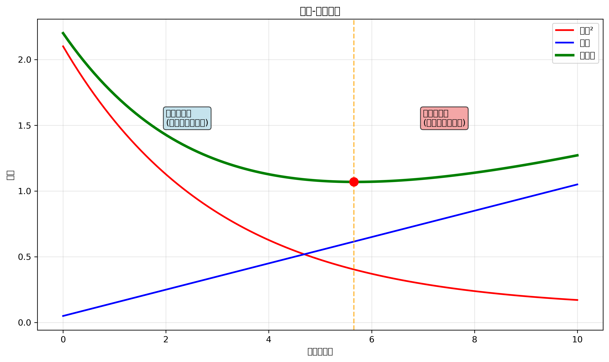
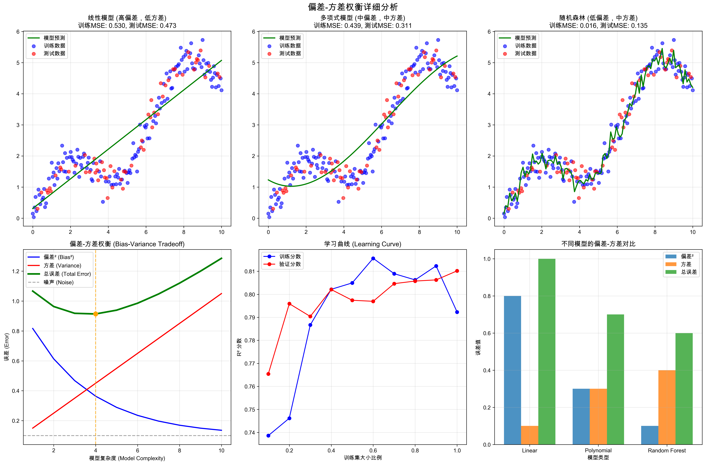
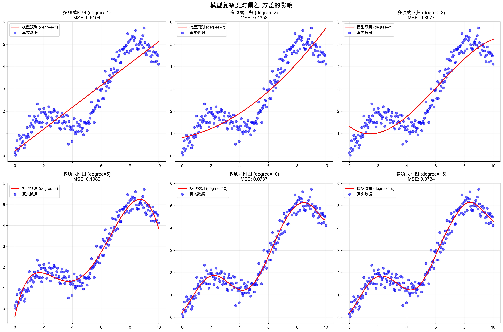
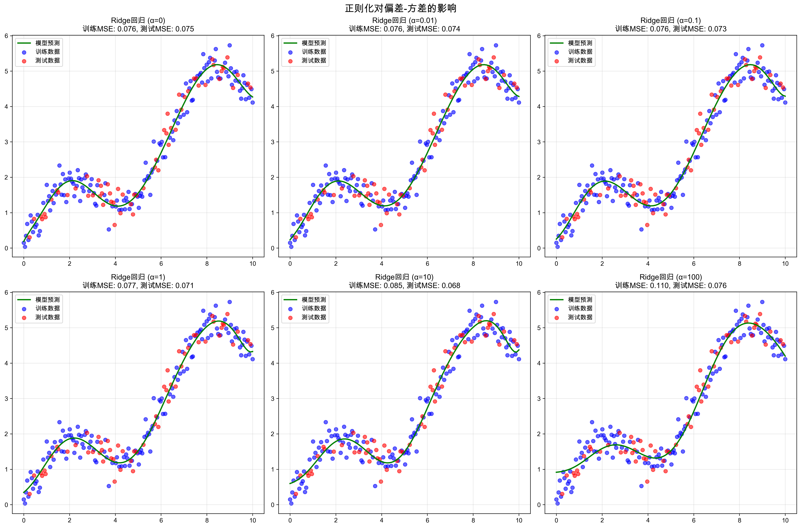

# 机器学习基础问题 - 详细答案

## 问题: 什么是偏差-方差权衡(Bias-Variance Tradeoff)？

### 中文理解 (便于记忆)

#### 偏差-方差权衡 = "准确度 vs 稳定性"
想象射箭比赛：
- **偏差**：系统性误差，像瞄准器偏了，总是射偏同一个方向
- **方差**：随机性误差，像手抖，每次射箭都偏离目标不同方向
- **权衡**：需要在准确性和稳定性之间找到平衡

#### 偏差 (Bias) - "系统性误差"
- **现象**：模型过于简单，无法捕捉数据中的复杂模式
- **结果**：训练误差和测试误差都较高
- **比喻**：像用直线拟合曲线数据，总是有系统性偏差

#### 方差 (Variance) - "随机性误差"
- **现象**：模型过于复杂，对训练数据中微小变化过于敏感
- **结果**：训练误差低，测试误差高
- **比喻**：像过度拟合，记住了所有细节包括噪声

### 英文标准面试答案

#### 1. 基础定义 (Basic Definitions)

**Bias** is the systematic error from oversimplified assumptions in the learning algorithm. High bias can cause the model to miss relevant relations between features and target outputs (underfitting).

**Variance** is the error from sensitivity to small fluctuations in the training set. High variance can cause overfitting, where the model learns the noise in the training data rather than the underlying pattern.

#### 2. 数学表示 (Mathematical Representation)

**误差分解公式详细解释：**

```
Total Error = Bias² + Variance + Irreducible Error
```

**每个符号的含义：**

- **Total Error**：总误差
  - 例子：模型在测试集上的平均平方误差
  - 这是我们想要最小化的目标

- **Bias²**：偏差的平方（系统性误差）
  - 例子：模型预测的平均值与真实值的差距
  - 如果模型总是预测过高或过低，就有高偏差
  - 数学定义：Bias = E[f̂(x)] - f(x)
    - E[f̂(x)]：模型预测的期望值
    - f(x)：真实值

- **Variance**：方差（随机性误差）
  - 例子：模型预测的波动程度
  - 如果模型对训练数据的小变化很敏感，就有高方差
  - 数学定义：Variance = E[(f̂(x) - E[f̂(x)])²]
    - f̂(x) - E[f̂(x)]：单次预测与平均预测的偏差

- **Irreducible Error**：不可减少的误差（噪声）
  - 例子：数据中的随机噪声
  - 这是数据本身的问题，无法通过改进模型来减少
  - 比如：测量误差、标签错误等

**实际例子：**
假设我们要预测房价：
- **高偏差**：模型总是预测房价比实际低10万（系统性低估）
- **高方差**：模型预测很不稳定，有时高有时低（对训练数据敏感）
- **噪声**：房价数据中有测量错误或异常值

```
总误差 = (系统性低估)² + (预测不稳定) + (数据噪声)
```

**为什么是Bias²而不是Bias？**
- 因为偏差可能是正数或负数（高估或低估）
- 平方后变成正数，便于与其他误差项相加
- 数学上更合理，符合最小二乘法的原理

#### 3. 四种状态 (Four States)

| 状态 | 偏差 | 方差 | 现象 | 解决方案 |
|------|------|------|------|----------|
| **理想** | 低 | 低 | 既准确又稳定 | 保持当前复杂度 |
| **过拟合** | 低 | 高 | 训练好，测试差 | 减少复杂度，正则化 |
| **欠拟合** | 高 | 低 | 训练和测试都差 | 增加复杂度，特征工程 |
| **最差** | 高 | 高 | 既不准又不稳定 | 重新设计模型 |

#### 4. 实际检测方法 (Detection Methods)

**High Bias Indicators:**
```python
# 检测高偏差
if train_error > threshold and test_error ≈ train_error:
    print("High bias detected - model too simple")
```

**High Variance Indicators:**
```python
# 检测高方差
if train_error << test_error:
    print("High variance detected - model too complex")
```

#### 5. 解决方案 (Solutions)

**For High Bias (Underfitting):**
1. **Increase Model Complexity**: Add more layers/features
2. **Feature Engineering**: Create more informative features
3. **Reduce Regularization**: Lower penalty strength
4. **Longer Training**: Train for more epochs
5. **Ensemble Methods**: Combine multiple models

**For High Variance (Overfitting):**
1. **Regularization**: Add L1/L2 penalty terms
2. **Cross-validation**: Better estimate of model performance
3. **Early Stopping**: Stop training when validation loss increases
4. **Dropout**: Randomly disable neurons during training
5. **Data Augmentation**: Increase effective training data size

### 面试常见问题及回答

#### Q1: "Explain the mathematical derivation of bias-variance decomposition"

**Answer:**
```python
# 偏差-方差分解推导
import numpy as np

def bias_variance_decomposition():
    """
    总误差 = E[(y - f̂(x))²] = Bias² + Variance + Noise
    
    Where:
    - Bias² = [E[f̂(x)] - f(x)]²  # 系统性误差
    - Variance = E[(f̂(x) - E[f̂(x)])²]  # 随机性误差
    - Noise = E[(y - f(x))²]  # 数据噪声
    """
    
    # 模拟多个模型预测
    predictions = []  # 不同训练集的模型预测
    
    for i in range(100):  # 100个不同的训练集
        model = train_model(train_data_i)
        pred = model.predict(test_x)
        predictions.append(pred)
    
    # 计算偏差和方差
    mean_pred = np.mean(predictions)
    bias_squared = (mean_pred - true_y) ** 2
    variance = np.var(predictions)
    
    return bias_squared, variance
```

#### Q2: "How do you choose the right model complexity?"

**Answer:**
```python
# 模型复杂度选择
from sklearn.model_selection import validation_curve
import matplotlib.pyplot as plt

def find_optimal_complexity():
    # 使用验证曲线
    train_scores, val_scores = validation_curve(
        model, X, y, param_name='complexity', 
        param_range=complexity_range, cv=5
    )
    
    # 绘制学习曲线
    plt.plot(complexity_range, train_scores.mean(axis=1), 'o-', label='Training')
    plt.plot(complexity_range, val_scores.mean(axis=1), 'o-', label='Validation')
    
    # 最优复杂度：验证分数最高的点
    optimal_complexity = complexity_range[np.argmax(val_scores.mean(axis=1))]
    
    return optimal_complexity
```

#### Q3: "What's the difference between L1 and L2 regularization in this context?"

**Answer:**
- **L1 (Lasso)**: 
  - Penalty: `λ * Σ|w|`
  - Effect on bias: Increases bias (feature selection)
  - Effect on variance: Decreases variance (sparse solutions)
  - Use case: When you want to remove irrelevant features

- **L2 (Ridge)**:
  - Penalty: `λ * Σw²`  
  - Effect on bias: Slightly increases bias
  - Effect on variance: Significantly decreases variance
  - Use case: When you want to keep all features but reduce overfitting

#### Q4: "How does cross-validation help with bias-variance tradeoff?"

**Answer:**
```python
# 交叉验证帮助估计真实性能
from sklearn.model_selection import cross_val_score

def evaluate_model_bias_variance(model, X, y):
    # 交叉验证分数
    cv_scores = cross_val_score(model, X, y, cv=5)
    
    # 训练分数
    model.fit(X, y)
    train_score = model.score(X, y)
    
    # 分析偏差和方差
    bias_estimate = train_score - cv_scores.mean()
    variance_estimate = cv_scores.std()
    
    print(f"Bias estimate: {bias_estimate:.3f}")
    print(f"Variance estimate: {variance_estimate:.3f}")
    
    return bias_estimate, variance_estimate
```

### 实战技巧

#### 1. 回答结构 (Answer Structure)
1. **定义** (Definition): 清晰定义偏差和方差
2. **数学** (Mathematics): 给出误差分解公式
3. **四种状态** (Four States): 解释不同组合的含义
4. **检测** (Detection): 如何识别问题
5. **解决** (Solutions): 具体的解决方法
6. **例子** (Examples): 提供实际代码案例

#### 2. 关键词 (Key Terms)
- **Bias**: 系统性误差，欠拟合
- **Variance**: 随机性误差，过拟合
- **Tradeoff**: 权衡关系
- **Regularization**: 正则化
- **Cross-validation**: 交叉验证
- **Model complexity**: 模型复杂度

#### 3. 常见陷阱 (Common Pitfalls)
- ❌ 混淆偏差和方差的定义
- ❌ 忽略数学公式的重要性
- ❌ 没有提到四种状态的完整分析
- ❌ 解决方案过于简单，没有具体方法

### 📊 可视化理解

#### 偏差-方差权衡图


#### 详细分析图


#### 模型复杂度分析


#### 正则化效果


#### 模型复杂度 vs 误差
```
低复杂度 → 高偏差，低方差 (欠拟合)
高复杂度 → 低偏差，高方差 (过拟合)
最优复杂度 → 平衡偏差和方差
```

#### 学习曲线模式
```
高偏差: 训练误差 ≈ 验证误差 (都高)
高方差: 训练误差 << 验证误差
理想: 训练误差 ≈ 验证误差 (都低)
```

### 面试准备检查清单

- [ ] 能清晰定义偏差和方差
- [ ] 理解数学分解公式
- [ ] 知道四种状态的完整分析
- [ ] 掌握检测方法
- [ ] 了解各种解决方案
- [ ] 能提供实际代码例子
- [ ] 理解正则化的作用机制
- [ ] 知道交叉验证的重要性
- [ ] 能解释模型复杂度选择

### 练习建议

1. **理论练习**: 用自己的话解释概念和数学公式
2. **代码练习**: 实现偏差-方差分解
3. **可视化练习**: 绘制学习曲线和复杂度分析图
4. **案例分析**: 分析不同模型的偏差-方差特性
5. **模拟面试**: 练习完整的回答流程

记住：面试官期望你不仅理解概念，还要能数学推导和实际应用！
