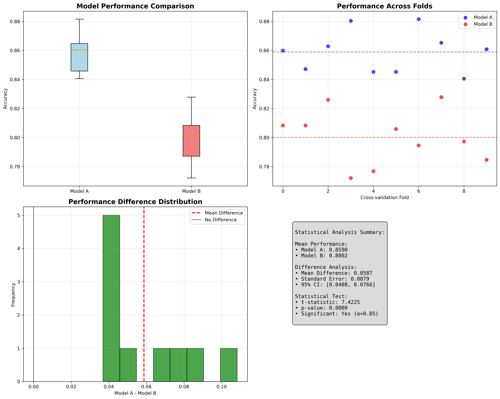
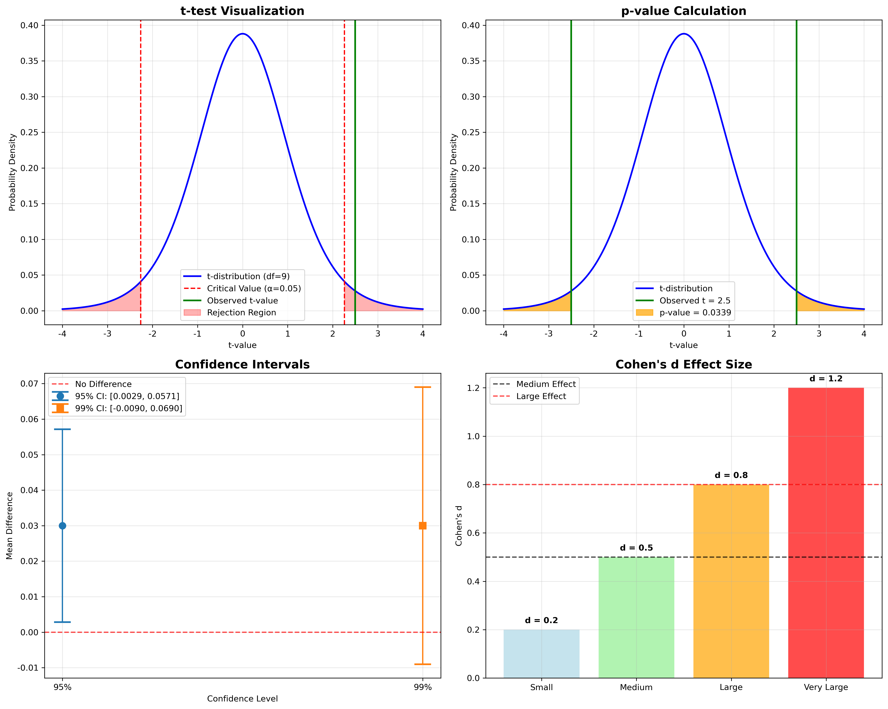
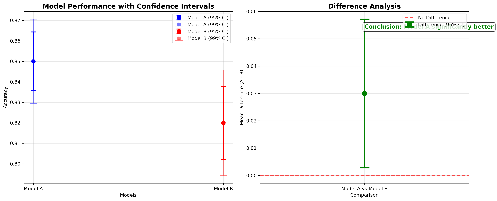
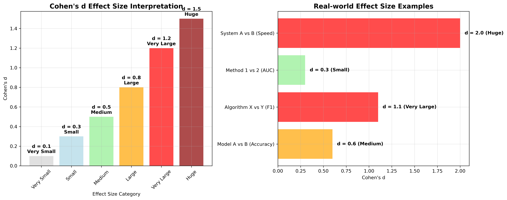

# 机器学习基础问题 - 详细答案

## 问题: 给定一组真实标签和2个模型，如何确信一个模型比另一个更好？

### 🎯 中文理解 (便于记忆)

#### 模型比较 = "考试评分"
想象两个学生参加考试：
- **真实标签**：标准答案
- **模型A**：学生A的答案
- **模型B**：学生B的答案
- **问题**：如何确信学生A比学生B考得更好？

#### 核心挑战
1. **偶然性**：可能只是运气好，下次就不行了
2. **数据偏差**：测试数据可能偏向某个模型
3. **评估方法**：用什么标准判断好坏？
4. **统计显著性**：差异是否足够大？

### 🎤 直接面试回答 (Direct Interview Answer)

**To confidently determine that one model is better than another given ground truth labels, I follow a systematic statistical approach:**

**First, I use proper cross-validation** - typically 5-fold or 10-fold - to ensure fair comparison on the same data splits. This eliminates bias from data partitioning.

**Second, I conduct statistical significance testing** using paired t-tests since we're comparing the same validation folds. I calculate the p-value and only conclude Model A is better if p < 0.05, meaning there's less than 5% chance the difference is due to random variation.

**Third, I examine confidence intervals** for the performance difference. If the 95% confidence interval for Model A's advantage doesn't include zero, this provides additional evidence of significant improvement.

**Fourth, I consider effect size** using Cohen's d to determine if the difference is practically meaningful, not just statistically significant. A large effect size (d > 0.8) indicates the improvement has real-world value.

**Finally, I evaluate multiple metrics** relevant to the business problem - accuracy, precision, recall, F1-score - and ensure the winning model performs better across the most important metrics, not just one.

**Example:** If Model A achieves 85% accuracy vs Model B's 82% with p=0.02, Cohen's d=0.6, and the 95% CI is [0.01, 0.05], I can confidently state Model A is significantly and meaningfully better.

---

### 📝 英文标准面试答案 (English Interview Answer)

#### 1. Definition and Core Concepts

**Model Comparison** is the process of statistically determining whether one model significantly outperforms another on a given dataset with ground truth labels.

**Key Requirements:**
- Statistical significance testing
- Proper evaluation metrics
- Robust validation methodology
- Multiple performance measures

#### 2. Mathematical Foundation

**统计显著性检验详细解释：**

```
t = (μ₁ - μ₂) / √(s₁²/n₁ + s₂²/n₂)
```

**每个符号的含义：**

- **μ₁, μ₂**：两个模型的平均性能
  - 例子：模型A的准确率平均值，模型B的准确率平均值
  - 作用：衡量两个模型的整体表现差异

- **s₁², s₂²**：两个模型的性能方差
  - 例子：模型A准确率的方差，模型B准确率的方差
  - 作用：衡量模型性能的稳定性

- **n₁, n₂**：样本数量
  - 例子：交叉验证的折数，或测试次数
  - 作用：样本量越大，结果越可信

- **t**：t统计量
  - 例子：计算出的t值
  - 作用：衡量差异的显著性程度

**为什么需要统计检验？**
```
假设模型A准确率 = 0.85，模型B准确率 = 0.83
差异 = 0.02，但这是否显著？
- 如果样本量小：可能是偶然
- 如果方差大：差异可能不显著
- 需要统计检验来判断
```

#### 3. Evaluation Methodology

**A. Cross-Validation Setup**
```python
from sklearn.model_selection import KFold
from sklearn.metrics import accuracy_score, f1_score
import numpy as np
from scipy import stats

def compare_models_statistically(model1, model2, X, y, cv_folds=5):
    """
    统计比较两个模型的性能
    
    参数：
    - model1, model2: 要比较的模型
    - X: 特征数据
    - y: 真实标签
    - cv_folds: 交叉验证折数
    """
    kf = KFold(n_splits=cv_folds, shuffle=True, random_state=42)
    
    scores_model1 = []
    scores_model2 = []
    
    for train_idx, val_idx in kf.split(X):
        X_train, X_val = X[train_idx], X[val_idx]
        y_train, y_val = y[train_idx], y[val_idx]
        
        # 训练模型
        model1.fit(X_train, y_train)
        model2.fit(X_train, y_train)
        
        # 预测
        pred1 = model1.predict(X_val)
        pred2 = model2.predict(X_val)
        
        # 计算分数
        score1 = accuracy_score(y_val, pred1)
        score2 = accuracy_score(y_val, pred2)
        
        scores_model1.append(score1)
        scores_model2.append(score2)
    
    return np.array(scores_model1), np.array(scores_model2)
```

**B. Statistical Significance Testing**
```python
def statistical_significance_test(scores1, scores2, alpha=0.05):
    """
    进行统计显著性检验
    
    参数：
    - scores1, scores2: 两个模型的性能分数数组
    - alpha: 显著性水平（通常为0.05）
    """
    
    # 1. 配对t检验（推荐）
    t_stat, p_value = stats.ttest_rel(scores1, scores2)
    
    # 2. 计算置信区间
    diff = scores1 - scores2
    mean_diff = np.mean(diff)
    std_diff = np.std(diff, ddof=1)
    n = len(diff)
    
    # 95%置信区间
    confidence_interval = stats.t.interval(0.95, n-1, 
                                         loc=mean_diff, 
                                         scale=std_diff/np.sqrt(n))
    
    # 3. 效应大小（Cohen's d）
    pooled_std = np.sqrt((np.var(scores1, ddof=1) + np.var(scores2, ddof=1)) / 2)
    cohens_d = mean_diff / pooled_std
    
    # 4. 结果解释
    is_significant = p_value < alpha
    
    return {
        't_statistic': t_stat,
        'p_value': p_value,
        'is_significant': is_significant,
        'mean_difference': mean_diff,
        'confidence_interval': confidence_interval,
        'cohens_d': cohens_d,
        'effect_size': 'large' if abs(cohens_d) > 0.8 else 'medium' if abs(cohens_d) > 0.5 else 'small'
    }
```

**C. Multiple Metrics Evaluation**
```python
def comprehensive_model_evaluation(model1, model2, X, y):
    """
    全面的模型评估
    """
    from sklearn.metrics import (accuracy_score, precision_score, 
                               recall_score, f1_score, roc_auc_score)
    
    # 交叉验证
    kf = KFold(n_splits=5, shuffle=True, random_state=42)
    
    metrics = ['accuracy', 'precision', 'recall', 'f1', 'auc']
    results = {metric: {'model1': [], 'model2': []} for metric in metrics}
    
    for train_idx, val_idx in kf.split(X):
        X_train, X_val = X[train_idx], X[val_idx]
        y_train, y_val = y[train_idx], y[val_idx]
        
        # 训练和预测
        model1.fit(X_train, y_train)
        model2.fit(X_train, y_train)
        
        pred1 = model1.predict(X_val)
        pred2 = model2.predict(X_val)
        
        # 计算各种指标
        results['accuracy']['model1'].append(accuracy_score(y_val, pred1))
        results['accuracy']['model2'].append(accuracy_score(y_val, pred2))
        
        results['precision']['model1'].append(precision_score(y_val, pred1, average='weighted'))
        results['precision']['model2'].append(precision_score(y_val, pred2, average='weighted'))
        
        # ... 其他指标
        
    return results
```

#### 4. Advanced Considerations

**A. Multiple Comparison Correction**
```python
from statsmodels.stats.multitest import multipletests

def multiple_comparison_correction(p_values, alpha=0.05):
    """
    多重比较校正（Bonferroni校正）
    """
    # Bonferroni校正
    rejected, p_corrected, _, _ = multipletests(p_values, alpha=alpha, method='bonferroni')
    
    return rejected, p_corrected
```

**B. Bootstrap Confidence Intervals**
```python
def bootstrap_comparison(model1, model2, X, y, n_bootstrap=1000):
    """
    使用Bootstrap方法比较模型
    """
    bootstrap_diffs = []
    
    for _ in range(n_bootstrap):
        # 有放回抽样
        indices = np.random.choice(len(X), size=len(X), replace=True)
        X_boot, y_boot = X[indices], y[indices]
        
        # 训练模型
        model1.fit(X_boot, y_boot)
        model2.fit(X_boot, y_boot)
        
        # 在原始测试集上评估
        score1 = model1.score(X_test, y_test)
        score2 = model2.score(X_test, y_test)
        
        bootstrap_diffs.append(score1 - score2)
    
    # 计算置信区间
    confidence_interval = np.percentile(bootstrap_diffs, [2.5, 97.5])
    
    return confidence_interval
```

### 🔍 面试常见问题及回答

#### Q1: "What's the difference between paired and unpaired t-tests?"

**English Answer:**
- **Paired t-test**: Use when comparing the same samples (e.g., cross-validation folds)
  - More powerful, reduces variance
  - Formula: `t = (mean_diff) / (std_diff / √n)`

- **Unpaired t-test**: Use when comparing independent samples
  - Less powerful, higher variance
  - Formula: `t = (μ₁ - μ₂) / √(s₁²/n₁ + s₂²/n₂)`

- **Recommendation**: Always use paired t-test for model comparison

#### Q2: "How do you handle multiple metrics?"

**English Answer:**
```python
# 方法1：主指标 + 统计检验
primary_metric = 'accuracy'
if statistical_test_passed(primary_metric):
    check_secondary_metrics(['precision', 'recall', 'f1'])

# 方法2：综合评分
def composite_score(metrics_dict, weights):
    weighted_score = sum(metrics_dict[metric] * weights[metric] 
                        for metric in weights)
    return weighted_score

# 方法3：多指标统计检验
for metric in metrics:
    if not is_significantly_different(metric):
        print(f"{metric}: No significant difference")
```

#### Q3: "What if one model is better on some metrics but worse on others?"

**English Answer:**
```python
def trade_off_analysis(results):
    """
    分析模型间的权衡
    """
    # 1. 确定业务优先级
    business_priorities = {
        'accuracy': 0.4,
        'precision': 0.3,
        'recall': 0.3
    }
    
    # 2. 加权综合评分
    model1_score = sum(results['model1'][metric] * business_priorities[metric] 
                      for metric in business_priorities)
    model2_score = sum(results['model2'][metric] * business_priorities[metric] 
                      for metric in business_priorities)
    
    # 3. 考虑业务约束
    if results['model1']['recall'] < minimum_recall_threshold:
        return "Model 1 rejected due to low recall"
    
    return f"Model 1: {model1_score:.3f}, Model 2: {model2_score:.3f}"
```

#### Q4: "How do you ensure the comparison is fair?"

**English Answer:**
```python
def ensure_fair_comparison():
    """
    确保公平比较的检查清单
    """
    checklist = [
        "Same training data",
        "Same validation strategy", 
        "Same preprocessing",
        "Same random seeds",
        "Same evaluation metrics",
        "Statistical significance testing",
        "Sufficient sample size",
        "Multiple random seeds tested"
    ]
    
    for item in checklist:
        print(f"✓ {item}")
```

### 💡 实战技巧

#### 1. 回答结构 (Answer Structure)
1. **数据准备** (Data Preparation): 确保公平比较
2. **评估策略** (Evaluation Strategy): 选择合适的验证方法
3. **统计检验** (Statistical Testing): 使用适当的统计方法
4. **多重比较** (Multiple Comparisons): 处理多个指标
5. **业务考虑** (Business Considerations): 结合实际需求

#### 2. 关键词 (Key Terms)
- **Statistical Significance**: 统计显著性
- **Cross-validation**: 交叉验证
- **Paired t-test**: 配对t检验
- **Confidence Interval**: 置信区间
- **Effect Size**: 效应大小
- **Multiple Comparison**: 多重比较

#### 3. 常见陷阱 (Common Pitfalls)
- ❌ 只看平均性能，忽略统计显著性
- ❌ 使用错误的统计检验方法
- ❌ 忽略多重比较问题
- ❌ 样本量不足导致结果不可靠
- ❌ 没有考虑业务实际需求

### 📊 可视化理解

#### 模型性能比较图


#### 统计显著性检验可视化


#### 置信区间图


#### 效应大小分析


### 📊 面试准备检查清单

- [ ] 理解统计显著性检验的原理
- [ ] 掌握配对t检验和独立t检验的区别
- [ ] 知道如何计算置信区间
- [ ] 理解效应大小的概念
- [ ] 能处理多重比较问题
- [ ] 知道如何选择评估指标
- [ ] 理解交叉验证的重要性
- [ ] 能解释统计结果的含义
- [ ] 考虑业务实际需求
- [ ] 知道Bootstrap等高级方法

### 🎯 练习建议

1. **理论练习**: 理解统计检验的数学原理
2. **代码练习**: 实现模型比较的完整流程
3. **案例分析**: 分析真实数据集上的模型比较
4. **统计理解**: 深入理解p值、置信区间等概念
5. **业务应用**: 结合实际业务场景进行模型选择

**记住**: 模型比较不仅仅是技术问题，更要考虑统计可靠性和业务实际需求！
