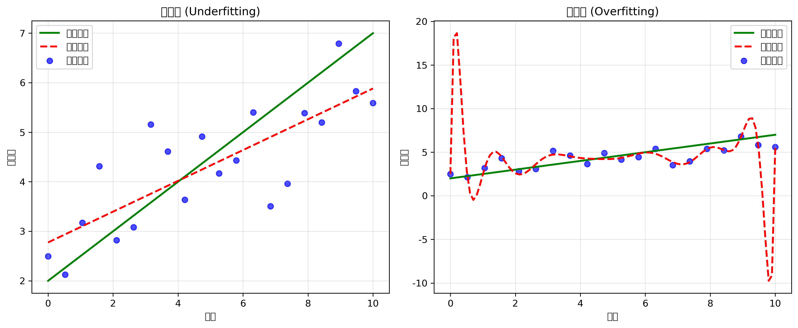

# 机器学习基础问题 - 详细答案

## 问题: 什么是过拟合(Overfitting)和欠拟合(Underfitting)？

### 中文理解 (便于记忆)

#### 过拟合 = "死记硬背"
- **现象**：模型把训练数据"背"得太熟，包括错误和噪声
- **结果**：遇到新题目(测试数据)就不会做了
- **比喻**：像学生背答案而不是理解原理

#### 欠拟合 = "学习不够"  
- **现象**：模型学得太浅，没有掌握数据中的规律
- **结果**：无论训练还是测试都做不好
- **比喻**：像只学了皮毛，没有深入理解

### 英文标准面试答案

#### 1. 基础定义 (Basic Definitions)

**Overfitting** occurs when a model learns the training data too well, including its noise and outliers, resulting in poor generalization to unseen data.

**Underfitting** occurs when a model is too simple to capture the underlying patterns in the data, resulting in poor performance on both training and test sets.

#### 2. 数学表示 (Mathematical Representation)

```
Total Error = Bias² + Variance + Irreducible Error

Where:
- Bias: Error from oversimplified assumptions
- Variance: Error from sensitivity to small fluctuations  
- Irreducible Error: Noise inherent in the data
```

#### 3. 检测方法 (Detection Methods)

**Overfitting Indicators:**
- Training accuracy >> Test accuracy
- Large gap between training and validation loss
- Model performs well on training data but poorly on new data

**Underfitting Indicators:**
- Training accuracy ≈ Test accuracy (both low)
- Small gap between training and validation loss
- Model fails to learn patterns in training data

#### 4. 解决方案 (Solutions)

**For Overfitting:**
1. **Regularization**: Add penalty terms to prevent overfitting
2. **Cross-validation**: Better estimate of model performance
3. **Early Stopping**: Stop training when validation loss increases
4. **Dropout**: Randomly disable neurons during training
5. **Data Augmentation**: Increase effective training data size

**For Underfitting:**
1. **Increase Model Complexity**: Add more layers/parameters
2. **Feature Engineering**: Create more informative features
3. **Reduce Regularization**: Lower penalty strength
4. **Longer Training**: Train for more epochs
5. **Ensemble Methods**: Combine multiple models

### 面试常见问题及回答

#### Q1: "How do you detect overfitting in practice?"

**Answer:**
```python
# Monitor training vs validation metrics
if train_accuracy > val_accuracy + threshold:
    print("Overfitting detected")

# Use learning curves
def plot_learning_curves(model, X, y):
    train_sizes = np.linspace(0.1, 1.0, 10)
    train_scores, val_scores = [], []
    
    for size in train_sizes:
        # Train on subset
        X_subset = X[:int(size * len(X))]
        y_subset = y[:int(size * len(y))]
        
        model.fit(X_subset, y_subset)
        train_scores.append(model.score(X_subset, y_subset))
        val_scores.append(model.score(X_val, y_val))
    
    # Plot curves - large gap indicates overfitting
```

#### Q2: "What's the difference between L1 and L2 regularization?"

**Answer:**
- **L1 (Lasso)**: 
  - Penalty: `λ * Σ|w|`
  - Effect: Feature selection, sparse solutions
  - Use case: When you want to remove irrelevant features

- **L2 (Ridge)**:
  - Penalty: `λ * Σw²`  
  - Effect: Shrinks weights, prevents overfitting
  - Use case: When you want to keep all features but reduce overfitting

- **Elastic Net**: Combines L1 + L2 for both benefits

#### Q3: "How do you choose the right model complexity?"

**Answer:**
1. **Cross-validation**: Use k-fold CV to estimate performance
2. **Validation curves**: Plot complexity vs performance
3. **Occam's Razor**: Choose simplest model that performs well
4. **Domain knowledge**: Consider interpretability requirements
5. **Computational constraints**: Balance performance vs efficiency

#### Q4: "Explain the bias-variance tradeoff with examples"

**Answer:**
```python
# High Bias (Underfitting) Example
# Simple linear model on complex data
linear_model = LinearRegression()
# Result: High bias, low variance

# High Variance (Overfitting) Example  
# Complex polynomial model on simple data
poly_model = PolynomialFeatures(degree=15)
# Result: Low bias, high variance

# Optimal Model
# Right complexity for the data
optimal_model = RandomForestClassifier(n_estimators=100)
# Result: Balanced bias and variance
```

### 实战技巧

#### 1. 回答结构 (Answer Structure)
1. **定义** (Definition): 简洁明确定义概念
2. **原因** (Causes): 解释为什么会发生
3. **检测** (Detection): 如何识别问题
4. **解决** (Solutions): 具体的解决方法
5. **例子** (Examples): 提供实际案例

#### 2. 关键词 (Key Terms)
- **Generalization**: 泛化能力
- **Cross-validation**: 交叉验证
- **Regularization**: 正则化
- **Bias-variance tradeoff**: 偏差-方差权衡
- **Learning curves**: 学习曲线
- **Early stopping**: 早停法

#### 3. 常见陷阱 (Common Pitfalls)
- ❌ 只谈理论，没有实际例子
- ❌ 混淆过拟合和欠拟合的解决方案
- ❌ 忽略偏差-方差权衡
- ❌ 没有提到交叉验证的重要性

### 📊 可视化理解

#### 过拟合/欠拟合分析图


#### 学习曲线模式
```
欠拟合: 训练误差 ≈ 测试误差 (都高)
过拟合: 训练误差 << 测试误差  
理想: 训练误差 ≈ 测试误差 (都低)
```

#### 模型复杂度 vs 性能
```
低复杂度 → 高偏差，低方差 (欠拟合)
高复杂度 → 低偏差，高方差 (过拟合)
最优复杂度 → 平衡偏差和方差
```

### 面试准备检查清单

- [ ] 能清晰定义过拟合和欠拟合
- [ ] 理解偏差-方差权衡
- [ ] 知道如何检测这两种问题
- [ ] 掌握各种解决方案
- [ ] 能提供实际代码例子
- [ ] 理解正则化的作用机制
- [ ] 知道交叉验证的重要性
- [ ] 能解释学习曲线的含义

### 练习建议

1. **理论练习**: 用自己的话解释概念
2. **代码练习**: 实现检测和解决方案
3. **案例分析**: 分析真实数据集的问题
4. **可视化**: 绘制学习曲线和偏差-方差图
5. **模拟面试**: 练习回答常见问题

记住：面试官更看重你的理解深度和实际应用能力，而不是死记硬背！
