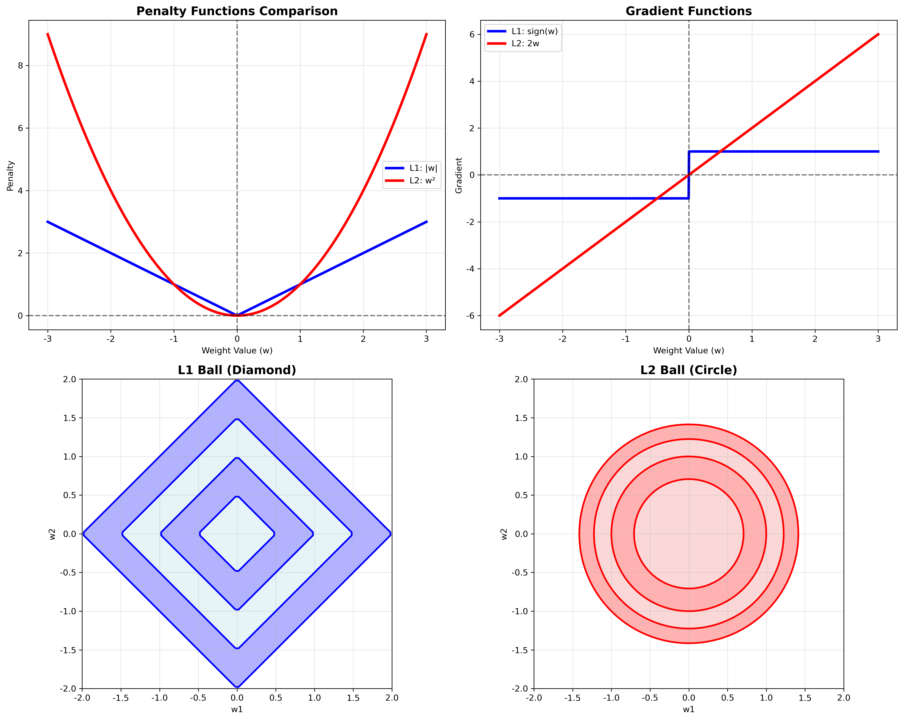
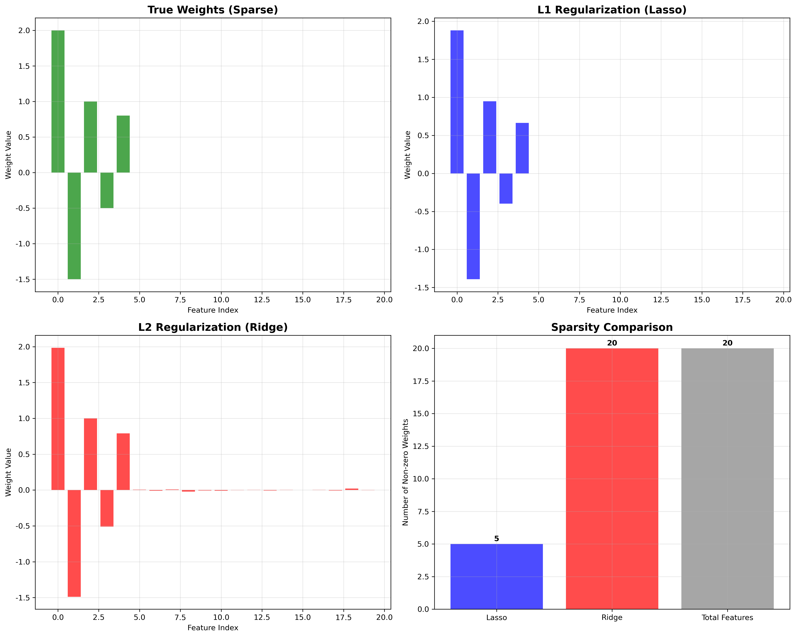
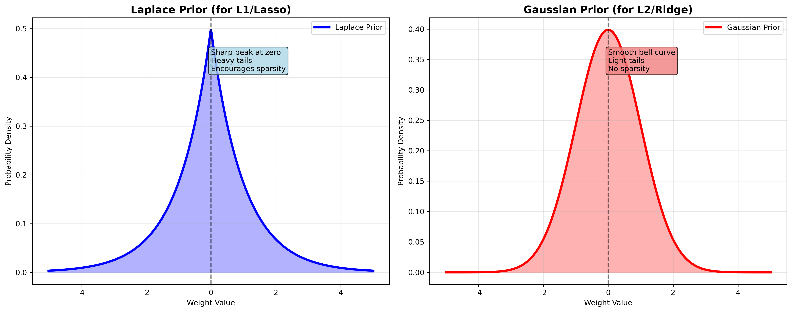
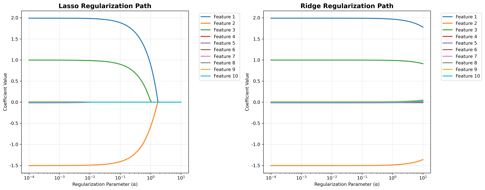

# 机器学习基础问题 - 详细答案

## 问题: 正则化(Regularization)详解 - L1 vs L2, Lasso vs Ridge

### 🎯 中文理解 (便于记忆)

#### 正则化 = "防止过度学习"
想象学生准备考试：
- **问题**：学生背了太多细节，包括错误答案，考试时遇到新题目就不会了
- **正则化**：给学习过程加约束，防止学得太复杂
- **目标**：找到简单但有效的规律，提高泛化能力

#### L1 vs L2 正则化 = "不同的惩罚方式"
- **L1正则化 (Lasso)**：像"一刀切"，直接删除不重要的特征
  - 比喻：老师要求删除所有不相关的知识点
  - 结果：产生稀疏解，很多权重变为0
  
- **L2正则化 (Ridge)**：像"温和提醒"，让所有权重都变小
  - 比喻：老师要求所有知识点都要学，但不要钻牛角尖
  - 结果：所有权重都保留，但数值变小

#### Lasso vs Ridge = "特征选择 vs 权重收缩"
- **Lasso**：自动进行特征选择，删除无关特征
- **Ridge**：保留所有特征，但减少过拟合

### 🎤 直接面试回答 (Direct Interview Answer)

**Regularization prevents overfitting by adding penalty terms to the loss function. L1 regularization (Lasso) uses absolute values of weights, creating sparse solutions that perform automatic feature selection. L2 regularization (Ridge) uses squared weights, shrinking all parameters toward zero while keeping all features.**

**The mathematical difference is:** L1 penalty = λ∑|w_i| vs L2 penalty = λ∑w_i². L1's absolute value creates sharp corners at zero, forcing some weights to exactly zero, while L2's smooth penalty curve keeps all weights small but non-zero.

**Lasso corresponds to Laplace prior distribution** which has sharp peaks at zero, encouraging sparsity. **Ridge corresponds to Gaussian prior** which is smooth and centered at zero, encouraging small but non-zero values.

**L1 is more sparse than L2 because** the L1 penalty function has sharp corners at zero where gradients are discontinuous, making it easier for optimization algorithms to push weights to exactly zero. L2's smooth penalty makes it harder to reach exact zero.

**We use L1/L2 instead of L3/L4 because** higher-order penalties (L3, L4) create computational challenges - non-differentiable at zero and harder to optimize. L1/L2 provide the right balance of sparsity (L1) and smoothness (L2) for most practical applications.

---

### 📝 英文标准面试答案 (English Interview Answer)

#### 1. L1 vs L2 Regularization Comparison

**L1 Regularization (Lasso):**
```python
# Loss function with L1 penalty
Loss = MSE + λ∑|w_i|
```

**L2 Regularization (Ridge):**
```python
# Loss function with L2 penalty  
Loss = MSE + λ∑w_i²
```

**Key Differences:**

| Aspect | L1 (Lasso) | L2 (Ridge) |
|--------|------------|------------|
| **Penalty Function** | |w_i| | w_i² |
| **Sparsity** | Creates sparse solutions | No sparsity |
| **Feature Selection** | Automatic | Manual required |
| **Computational** | Non-differentiable at 0 | Everywhere differentiable |
| **Prior Distribution** | Laplace | Gaussian |
| **Geometric Shape** | Diamond (L1 ball) | Circle (L2 ball) |

#### 2. Lasso/Ridge Explanation and Priors

**Lasso (Least Absolute Shrinkage and Selection Operator):**

**Prior Distribution:** Laplace (Double Exponential)
```python
# Laplace prior: P(w) ∝ exp(-λ|w|)
# Mean = 0, Variance = 2/λ²
```

**Characteristics:**
- Sharp peak at zero
- Heavy tails
- Encourages sparsity
- Automatic feature selection

**Ridge Regression:**

**Prior Distribution:** Gaussian (Normal)
```python
# Gaussian prior: P(w) ∝ exp(-λw²/2)
# Mean = 0, Variance = 1/λ
```

**Characteristics:**
- Smooth, bell-shaped curve
- Light tails
- No sparsity
- Shrinks all coefficients

#### 3. Mathematical Derivation

**Lasso Derivation:**

**Step 1: Objective Function**
```
L(w) = (1/2n)||y - Xw||² + λ||w||₁
```

**Step 2: Subgradient**
```
∂L/∂w_j = -(1/n)X_j^T(y - Xw) + λ sign(w_j)
```

**Step 3: Soft Thresholding Solution**
```python
def lasso_coordinate_descent(X, y, lambda_reg, max_iter=1000):
    """
    Lasso coordinate descent algorithm
    """
    n, p = X.shape
    w = np.zeros(p)
    
    for iteration in range(max_iter):
        for j in range(p):
            # Calculate partial residual
            r = y - X @ w + w[j] * X[:, j]
            
            # Calculate coefficient
            rho_j = X[:, j].T @ r / n
            
            # Soft thresholding
            if rho_j > lambda_reg:
                w[j] = rho_j - lambda_reg
            elif rho_j < -lambda_reg:
                w[j] = rho_j + lambda_reg
            else:
                w[j] = 0
                
    return w
```

**Ridge Derivation:**

**Step 1: Objective Function**
```
L(w) = (1/2n)||y - Xw||² + λ||w||₂²
```

**Step 2: Gradient**
```
∂L/∂w = -(1/n)X^T(y - Xw) + λw
```

**Step 3: Closed-form Solution**
```python
def ridge_closed_form(X, y, lambda_reg):
    """
    Ridge regression closed-form solution
    """
    n, p = X.shape
    # Add regularization term to diagonal
    XTX = X.T @ X + lambda_reg * np.eye(p)
    XTy = X.T @ y
    
    # Solve: (X^T X + λI)w = X^T y
    w = np.linalg.solve(XTX, XTy)
    return w
```

#### 4. Why L1 is More Sparse Than L2

**Mathematical Explanation:**

**L1 Penalty Function:**
```
f(w) = |w|
f'(w) = sign(w) = {1 if w > 0, -1 if w < 0, undefined at w = 0}
```

**L2 Penalty Function:**
```
f(w) = w²
f'(w) = 2w
```

**Key Insight:**
- L1 has **discontinuous gradient** at zero
- L2 has **continuous gradient** everywhere
- Optimization algorithms can "jump" to zero with L1
- L2 gradient approaches zero smoothly but rarely reaches exactly zero

**Geometric Visualization:**
```python
import numpy as np
import matplotlib.pyplot as plt

# Create visualization
w = np.linspace(-3, 3, 1000)

# L1 and L2 penalty functions
l1_penalty = np.abs(w)
l2_penalty = w**2

# Gradients
l1_grad = np.sign(w)
l2_grad = 2 * w

# Plot
fig, (ax1, ax2) = plt.subplots(1, 2, figsize=(12, 5))

# Penalty functions
ax1.plot(w, l1_penalty, 'b-', label='L1: |w|', linewidth=2)
ax1.plot(w, l2_penalty, 'r-', label='L2: w²', linewidth=2)
ax1.set_title('Penalty Functions')
ax1.legend()
ax1.grid(True)

# Gradients
ax2.plot(w, l1_grad, 'b-', label='L1 gradient: sign(w)', linewidth=2)
ax2.plot(w, l2_grad, 'r-', label='L2 gradient: 2w', linewidth=2)
ax2.axhline(y=0, color='k', linestyle='--', alpha=0.5)
ax2.axvline(x=0, color='k', linestyle='--', alpha=0.5)
ax2.set_title('Gradient Functions')
ax2.legend()
ax2.grid(True)
```

#### 5. Why Regularization Works

**Statistical Perspective:**

**Bias-Variance Tradeoff:**
```
Total Error = Bias² + Variance + Irreducible Error
```

**Without Regularization:**
- Low bias, high variance (overfitting)
- Model memorizes training data

**With Regularization:**
- Slightly higher bias, much lower variance
- Better generalization to new data

**Bayesian Interpretation:**

**Maximum Likelihood (No Regularization):**
```
w_ML = argmax P(y|X, w)
```

**Maximum A Posteriori (With Regularization):**
```
w_MAP = argmax P(y|X, w) × P(w)
```

**Regularization term P(w) acts as prior knowledge:**
- L1: "Most weights should be zero"
- L2: "All weights should be small"

#### 6. Why L1/L2 Instead of L3/L4

**Computational Challenges:**

**L3 Penalty:**
```
f(w) = |w|³
f'(w) = 3w² × sign(w)  # Discontinuous at zero
```

**L4 Penalty:**
```
f(w) = w⁴
f'(w) = 4w³  # Continuous but very steep
```

**Problems with Higher Orders:**

1. **Computational Complexity:**
   - L3: Non-differentiable at zero
   - L4: Very steep gradients, optimization difficulties

2. **Optimization Issues:**
   - L3: Coordinate descent fails at zero
   - L4: Gradient descent becomes unstable

3. **Practical Benefits Diminish:**
   - L1: Perfect sparsity
   - L2: Good shrinkage
   - L3/L4: No additional practical benefits

**Mathematical Proof:**
```python
def compare_penalties():
    """Compare different penalty functions"""
    w = np.linspace(-2, 2, 1000)
    
    penalties = {
        'L1': np.abs(w),
        'L2': w**2,
        'L3': np.abs(w)**3,
        'L4': w**4
    }
    
    gradients = {
        'L1': np.sign(w),
        'L2': 2 * w,
        'L3': 3 * w**2 * np.sign(w),
        'L4': 4 * w**3
    }
    
    # L1 and L2 are optimal for most applications
    # L3/L4 provide diminishing returns with increased complexity
```

### 💻 实际代码示例

#### Complete Regularization Implementation
```python
import numpy as np
from sklearn.linear_model import Lasso, Ridge
from sklearn.preprocessing import StandardScaler
import matplotlib.pyplot as plt

class RegularizedRegression:
    def __init__(self, alpha=1.0, regularization='l2'):
        self.alpha = alpha
        self.regularization = regularization
        self.weights = None
        self.scaler = StandardScaler()
    
    def fit(self, X, y):
        """Fit regularized regression model"""
        # Standardize features
        X_scaled = self.scaler.fit_transform(X)
        
        if self.regularization == 'l1':
            self.weights = self._lasso_fit(X_scaled, y)
        elif self.regularization == 'l2':
            self.weights = self._ridge_fit(X_scaled, y)
        else:
            raise ValueError("Regularization must be 'l1' or 'l2'")
    
    def _lasso_fit(self, X, y, max_iter=1000, tol=1e-4):
        """Lasso using coordinate descent"""
        n, p = X.shape
        w = np.zeros(p)
        
        for iteration in range(max_iter):
            w_old = w.copy()
            
            for j in range(p):
                # Calculate partial residual
                r = y - X @ w + w[j] * X[:, j]
                
                # Calculate coefficient
                rho_j = X[:, j].T @ r / n
                
                # Soft thresholding
                if rho_j > self.alpha:
                    w[j] = rho_j - self.alpha
                elif rho_j < -self.alpha:
                    w[j] = rho_j + self.alpha
                else:
                    w[j] = 0
            
            # Check convergence
            if np.max(np.abs(w - w_old)) < tol:
                break
                
        return w
    
    def _ridge_fit(self, X, y):
        """Ridge regression closed-form solution"""
        n, p = X.shape
        # Add regularization term to diagonal
        XTX = X.T @ X + self.alpha * np.eye(p)
        XTy = X.T @ y
        
        # Solve: (X^T X + λI)w = X^T y
        w = np.linalg.solve(XTX, XTy)
        return w
    
    def predict(self, X):
        """Make predictions"""
        X_scaled = self.scaler.transform(X)
        return X_scaled @ self.weights

# Example usage
def regularization_comparison_example():
    """Compare L1 and L2 regularization"""
    # Generate synthetic data
    np.random.seed(42)
    n, p = 100, 20
    X = np.random.randn(n, p)
    
    # Create sparse true weights (only first 5 are non-zero)
    true_weights = np.zeros(p)
    true_weights[:5] = [2, -1.5, 1, -0.5, 0.8]
    
    # Generate target with noise
    y = X @ true_weights + 0.1 * np.random.randn(n)
    
    # Fit models
    lasso_model = RegularizedRegression(alpha=0.1, regularization='l1')
    ridge_model = RegularizedRegression(alpha=0.1, regularization='l2')
    
    lasso_model.fit(X, y)
    ridge_model.fit(X, y)
    
    # Compare results
    print("True weights (first 10):", true_weights[:10])
    print("Lasso weights (first 10):", lasso_model.weights[:10])
    print("Ridge weights (first 10):", ridge_model.weights[:10])
    
    # Count non-zero weights
    lasso_sparsity = np.sum(np.abs(lasso_model.weights) > 1e-6)
    ridge_sparsity = np.sum(np.abs(ridge_model.weights) > 1e-6)
    
    print(f"Lasso non-zero weights: {lasso_sparsity}/{p}")
    print(f"Ridge non-zero weights: {ridge_sparsity}/{p}")

if __name__ == "__main__":
    regularization_comparison_example()
```

### 🔍 面试常见问题及回答

#### Q1: "What's the difference between L1 and L2 regularization?"

**English Answer:**
L1 regularization uses absolute values of weights (λ∑|w_i|) and creates sparse solutions by setting some weights to exactly zero, performing automatic feature selection. L2 regularization uses squared weights (λ∑w_i²) and shrinks all weights toward zero while keeping them non-zero, preventing overfitting without feature selection.

#### Q2: "Why does L1 create sparse solutions while L2 doesn't?"

**English Answer:**
L1's penalty function |w| has a sharp corner at zero where the gradient is discontinuous. During optimization, when a weight approaches zero, the L1 penalty can "push" it to exactly zero. L2's penalty w² is smooth everywhere with gradient 2w, making it difficult to reach exactly zero during optimization.

#### Q3: "What are the prior distributions for Lasso and Ridge?"

**English Answer:**
Lasso corresponds to a Laplace (double exponential) prior: P(w) ∝ exp(-λ|w|), which has sharp peaks at zero encouraging sparsity. Ridge corresponds to a Gaussian prior: P(w) ∝ exp(-λw²/2), which is smooth and centered at zero, encouraging small but non-zero weights.

#### Q4: "How do you choose the regularization parameter λ?"

**English Answer:**
I use cross-validation to find the optimal λ. For Lasso, I often use L1 path algorithms to efficiently compute solutions for multiple λ values. I also consider the bias-variance tradeoff - larger λ reduces variance but increases bias. The optimal λ balances this tradeoff based on validation performance.

### 💡 实战技巧

#### 1. 回答结构 (Answer Structure)
1. **定义和区别** (Definitions and Differences): L1 vs L2的基本概念
2. **数学原理** (Mathematical Principles): 惩罚函数和梯度
3. **先验分布** (Prior Distributions): 贝叶斯解释
4. **稀疏性原理** (Sparsity Principles): 为什么L1更稀疏
5. **实际应用** (Practical Applications): 何时使用哪种正则化

#### 2. 关键词 (Key Terms)
- **L1 Regularization**: L1正则化
- **L2 Regularization**: L2正则化
- **Sparsity**: 稀疏性
- **Feature Selection**: 特征选择
- **Prior Distribution**: 先验分布
- **Soft Thresholding**: 软阈值
- **Coordinate Descent**: 坐标下降

#### 3. 常见陷阱 (Common Pitfalls)
- ❌ 混淆L1和L2的几何形状
- ❌ 不理解为什么L1产生稀疏解
- ❌ 忽略正则化参数的调优
- ❌ 不考虑数据的标准化
- ❌ 不理解贝叶斯解释

### 📊 可视化理解

#### L1 vs L2 正则化对比


#### 稀疏性可视化


#### 先验分布对比


#### 正则化路径


### 📊 面试准备检查清单

- [ ] 理解L1和L2正则化的数学定义
- [ ] 掌握Lasso和Ridge的推导过程
- [ ] 理解为什么L1比L2稀疏
- [ ] 知道Lasso和Ridge的先验分布
- [ ] 能够解释正则化为什么有效
- [ ] 理解为什么使用L1/L2而不是L3/L4
- [ ] 掌握正则化参数的选择方法
- [ ] 能够实现简单的正则化算法
- [ ] 理解贝叶斯解释
- [ ] 知道实际应用中的注意事项

### 🎯 练习建议

1. **理论练习**: 推导Lasso和Ridge的数学公式
2. **代码练习**: 实现坐标下降算法
3. **可视化练习**: 绘制不同正则化参数的路径
4. **应用练习**: 在真实数据上比较L1和L2效果
5. **参数调优**: 使用交叉验证选择最优λ

**记住**: 正则化是防止过拟合的重要技术，L1用于特征选择，L2用于权重收缩，选择哪种取决于具体问题需求！
