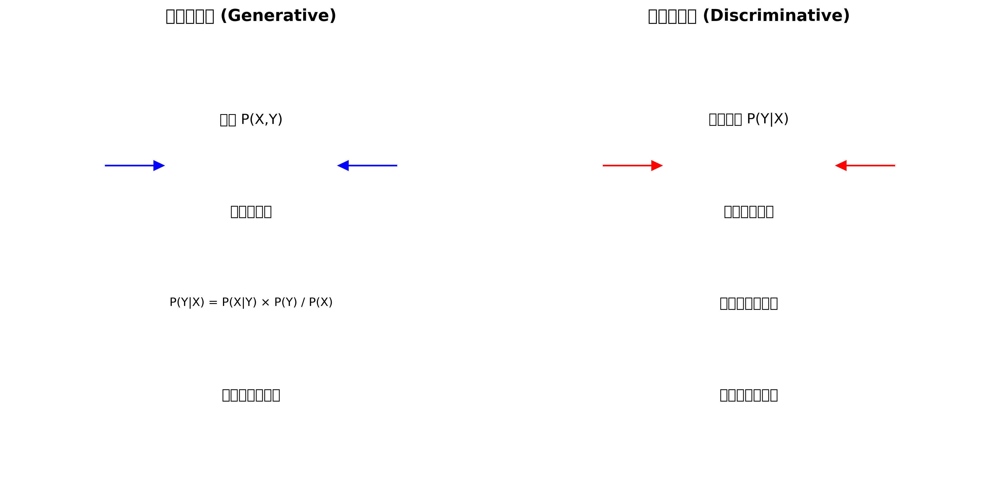
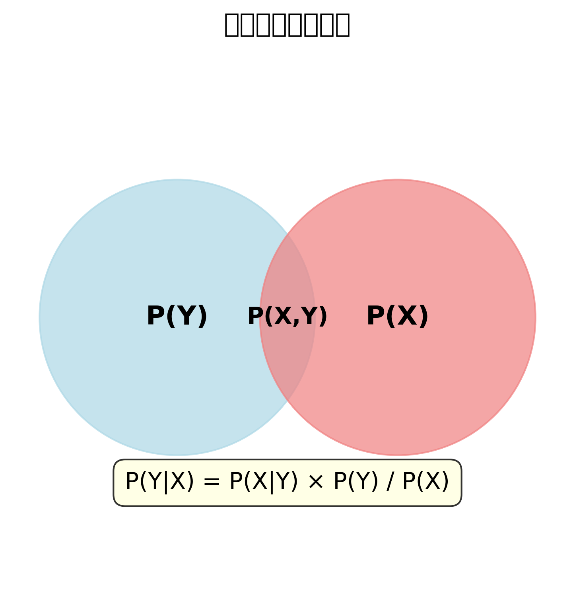

# 机器学习基础问题 - 详细答案

## 问题: 生成式模型(Generative)和判别式模型(Discriminative)的区别？

### 中文理解

#### 生成式模型 (Generative Models) - "理解整体规律"
想象一个画家，他不仅会画不同风格的画，还能告诉你这幅画是什么风格的。生成式模型就像这个画家：
- **目标**：学习数据的完整分布规律
- **能力**：既能分类，又能生成新数据
- **方法**：先学习P(X,Y)，再通过贝叶斯定理得到P(Y|X)
- **比喻**：学会"造物"的规律，然后进行分类

#### 判别式模型 (Discriminative Models) - "直接找分界线"
想象一个裁判，他不需要了解比赛的完整规则，只需要知道如何判断输赢。判别式模型就像这个裁判：
- **目标**：直接学习分类边界
- **能力**：专注于分类任务
- **方法**：直接学习P(Y|X)
- **比喻**：直接画出一条分界线，不需要理解数据的生成过程

### 英文标准面试答案

#### Generative vs Discriminative Models

**Generative Models** learn the joint probability distribution P(X,Y) of inputs and labels, then use Bayes' theorem to compute P(Y|X) for classification.

**Discriminative Models** directly learn the conditional probability P(Y|X) or the decision boundary between classes.

#### 数学基础 (Mathematical Foundation)

**贝叶斯定理详细解释：**

```
P(Y|X) = P(X|Y) × P(Y) / P(X)
```

**每个符号的含义：**
- **P(Y|X)**：在给定X的条件下，Y发生的概率（后验概率）
  - 例子：给定一张图片X，它是猫的概率
  - 这是我们最终想要的结果

- **P(X|Y)**：在给定Y的条件下，X发生的概率（似然概率）
  - 例子：如果这是一只猫，那么看到这张图片的概率
  - 生成式模型学习的就是这个概率

- **P(Y)**：Y发生的先验概率
  - 例子：在数据集中，猫出现的总体概率
  - 比如：1000张图片中有200张是猫，那么P(猫) = 0.2

- **P(X)**：X发生的边际概率
  - 例子：这张图片在数据集中出现的概率
  - 通常很难直接计算，但可以通过全概率公式计算

**实际例子：**
假设我们有一个图片分类任务：
- 数据集：1000张图片，200张猫，800张狗
- 特征X：图片的像素值
- 标签Y：猫或狗

```
P(猫|图片X) = P(图片X|猫) × P(猫) / P(图片X)

其中：
- P(猫) = 200/1000 = 0.2 (先验概率)
- P(图片X|猫) = 生成式模型学习：给定是猫，这张图片出现的概率
- P(图片X) = 这张图片在数据集中出现的总概率
- P(猫|图片X) = 给定这张图片，它是猫的概率 (我们想要的答案)
```

#### Key Differences

| Aspect | Generative Models | Discriminative Models |
|--------|------------------|---------------------|
| **What they learn** | P(X,Y) joint distribution | P(Y\|X) conditional distribution |
| **Approach** | Model data generation process | Model decision boundary |
| **Data efficiency** | Need more data | Can work with less data |
| **Computational cost** | Higher (more parameters) | Lower (fewer parameters) |
| **Interpretability** | High (understand data structure) | Lower (black box) |
| **Generative ability** | Can generate new samples | Cannot generate new samples |

#### Common Generative Models

**1. Naive Bayes:**
```python
from sklearn.naive_bayes import GaussianNB

# Assumes features are independent given class
model = GaussianNB()
model.fit(X_train, y_train)
predictions = model.predict(X_test)

# Can generate samples
generated_samples = model.sample(100)  # Not directly available in sklearn
```

**2. Gaussian Mixture Models:**
```python
from sklearn.mixture import GaussianMixture

# Models data as mixture of Gaussians
gmm = GaussianMixture(n_components=3)
gmm.fit(X_train)

# Can generate new samples
new_samples = gmm.sample(100)[0]
```

**3. Hidden Markov Models:**
```python
from hmmlearn import hmm

# For sequential data
model = hmm.GaussianHMM(n_components=3)
model.fit(sequences)

# Can generate new sequences
new_sequence = model.sample(100)
```

**4. Variational Autoencoders (VAE):**
```python
import tensorflow as tf
from tensorflow.keras import layers

class VAE(tf.keras.Model):
    def __init__(self, latent_dim):
        super(VAE, self).__init__()
        self.latent_dim = latent_dim
        self.encoder = tf.keras.Sequential([
            layers.Dense(512, activation='relu'),
            layers.Dense(256, activation='relu'),
            layers.Dense(latent_dim * 2)  # mean and log_var
        ])
        self.decoder = tf.keras.Sequential([
            layers.Dense(256, activation='relu'),
            layers.Dense(512, activation='relu'),
            layers.Dense(784)  # reconstructed image
        ])
    
    def encode(self, x):
        mean, log_var = tf.split(self.encoder(x), num_or_size_splits=2, axis=1)
        return mean, log_var
    
    def reparameterize(self, mean, log_var):
        eps = tf.random.normal(shape=mean.shape)
        return eps * tf.exp(log_var * .5) + mean
    
    def decode(self, z):
        return self.decoder(z)
    
    def call(self, x):
        mean, log_var = self.encode(x)
        z = self.reparameterize(mean, log_var)
        return self.decode(z), mean, log_var

# Can generate new images
vae = VAE(latent_dim=20)
# After training...
random_z = tf.random.normal(shape=(1, 20))
generated_image = vae.decode(random_z)
```

**5. Generative Adversarial Networks (GANs):**
```python
import tensorflow as tf

class Generator(tf.keras.Model):
    def __init__(self):
        super(Generator, self).__init__()
        self.model = tf.keras.Sequential([
            layers.Dense(256, activation='relu'),
            layers.Dense(512, activation='relu'),
            layers.Dense(784, activation='tanh')  # Generated image
        ])
    
    def call(self, noise):
        return self.model(noise)

class Discriminator(tf.keras.Model):
    def __init__(self):
        super(Discriminator, self).__init__()
        self.model = tf.keras.Sequential([
            layers.Dense(512, activation='relu'),
            layers.Dense(256, activation='relu'),
            layers.Dense(1, activation='sigmoid')  # Real or fake
        ])
    
    def call(self, x):
        return self.model(x)

# Can generate new samples
generator = Generator()
# After training...
random_noise = tf.random.normal(shape=(1, 100))
generated_sample = generator(random_noise)
```

#### Common Discriminative Models

**1. Logistic Regression:**
```python
from sklearn.linear_model import LogisticRegression

# Directly models P(Y|X)
model = LogisticRegression()
model.fit(X_train, y_train)
predictions = model.predict(X_test)
probabilities = model.predict_proba(X_test)
```

**2. Support Vector Machines:**
```python
from sklearn.svm import SVC

# Learns optimal decision boundary
model = SVC(kernel='rbf', probability=True)
model.fit(X_train, y_train)
predictions = model.predict(X_test)
```

**3. Decision Trees:**
```python
from sklearn.tree import DecisionTreeClassifier

# Learns decision rules
model = DecisionTreeClassifier()
model.fit(X_train, y_train)
predictions = model.predict(X_test)
```

**4. Neural Networks:**
```python
import tensorflow as tf

# Directly learns P(Y|X)
model = tf.keras.Sequential([
    layers.Dense(128, activation='relu'),
    layers.Dropout(0.3),
    layers.Dense(64, activation='relu'),
    layers.Dense(num_classes, activation='softmax')
])

model.compile(optimizer='adam', loss='categorical_crossentropy')
model.fit(X_train, y_train, epochs=100)
predictions = model.predict(X_test)
```

#### Practical Comparison Example

```python
import numpy as np
import matplotlib.pyplot as plt
from sklearn.datasets import make_classification
from sklearn.model_selection import train_test_split
from sklearn.naive_bayes import GaussianNB
from sklearn.linear_model import LogisticRegression
from sklearn.metrics import accuracy_score, classification_report
from sklearn.mixture import GaussianMixture

# Generate sample data
X, y = make_classification(n_samples=1000, n_features=2, n_redundant=0, 
                          n_informative=2, n_clusters_per_class=1, random_state=42)

X_train, X_test, y_train, y_test = train_test_split(X, y, test_size=0.3, random_state=42)

# 1. Generative Model: Naive Bayes
nb_model = GaussianNB()
nb_model.fit(X_train, y_train)
nb_predictions = nb_model.predict(X_test)
nb_accuracy = accuracy_score(y_test, nb_predictions)

print("Generative Model (Naive Bayes):")
print(f"Accuracy: {nb_accuracy:.4f}")
print("Classification Report:")
print(classification_report(y_test, nb_predictions))

# 2. Discriminative Model: Logistic Regression
lr_model = LogisticRegression()
lr_model.fit(X_train, y_train)
lr_predictions = lr_model.predict(X_test)
lr_accuracy = accuracy_score(y_test, lr_predictions)

print("\nDiscriminative Model (Logistic Regression):")
print(f"Accuracy: {lr_accuracy:.4f}")
print("Classification Report:")
print(classification_report(y_test, lr_predictions))

# 3. Visualization of Decision Boundaries
def plot_decision_boundary(model, X, y, title):
    plt.figure(figsize=(8, 6))
    
    # Create mesh
    h = 0.02
    x_min, x_max = X[:, 0].min() - 1, X[:, 0].max() + 1
    y_min, y_max = X[:, 1].min() - 1, X[:, 1].max() + 1
    xx, yy = np.meshgrid(np.arange(x_min, x_max, h),
                         np.arange(y_min, y_max, h))
    
    # Predict on mesh
    Z = model.predict(np.c_[xx.ravel(), yy.ravel()])
    Z = Z.reshape(xx.shape)
    
    # Plot decision boundary
    plt.contourf(xx, yy, Z, alpha=0.3, cmap='viridis')
    
    # Plot data points
    scatter = plt.scatter(X[:, 0], X[:, 1], c=y, cmap='viridis', edgecolors='black')
    plt.colorbar(scatter)
    plt.title(title)
    plt.xlabel('Feature 1')
    plt.ylabel('Feature 2')
    plt.show()

plot_decision_boundary(nb_model, X_test, y_test, "Generative Model Decision Boundary")
plot_decision_boundary(lr_model, X_test, y_test, "Discriminative Model Decision Boundary")

# 4. Generative Model: Sample Generation
print("\nGenerative Model Capabilities:")

# Use Gaussian Mixture Model to demonstrate generation
gmm = GaussianMixture(n_components=2)
gmm.fit(X_train)

# Generate new samples
generated_samples, generated_labels = gmm.sample(100)

plt.figure(figsize=(12, 5))

plt.subplot(1, 2, 1)
plt.scatter(X_train[:, 0], X_train[:, 1], c=y_train, cmap='viridis', alpha=0.7)
plt.title('Original Training Data')
plt.xlabel('Feature 1')
plt.ylabel('Feature 2')

plt.subplot(1, 2, 2)
plt.scatter(generated_samples[:, 0], generated_samples[:, 1], 
           c=generated_labels, cmap='viridis', alpha=0.7)
plt.title('Generated Samples')
plt.xlabel('Feature 1')
plt.ylabel('Feature 2')

plt.tight_layout()
plt.show()

# 5. Data Efficiency Comparison
print("\nData Efficiency Comparison:")

# Train on different sizes of data
data_sizes = [50, 100, 200, 500, 800]
nb_scores = []
lr_scores = []

for size in data_sizes:
    X_subset = X_train[:size]
    y_subset = y_train[:size]
    
    # Train models
    nb = GaussianNB()
    lr = LogisticRegression()
    
    nb.fit(X_subset, y_subset)
    lr.fit(X_subset, y_subset)
    
    # Evaluate
    nb_score = nb.score(X_test, y_test)
    lr_score = lr.score(X_test, y_test)
    
    nb_scores.append(nb_score)
    lr_scores.append(lr_score)

# Plot data efficiency
plt.figure(figsize=(10, 6))
plt.plot(data_sizes, nb_scores, 'o-', label='Generative (Naive Bayes)', linewidth=2)
plt.plot(data_sizes, lr_scores, 's-', label='Discriminative (Logistic Regression)', linewidth=2)
plt.xlabel('Training Data Size')
plt.ylabel('Test Accuracy')
plt.title('Data Efficiency Comparison')
plt.legend()
plt.grid(True, alpha=0.3)
plt.show()

print("Data Efficiency Results:")
for i, size in enumerate(data_sizes):
    print(f"Data size {size}: NB={nb_scores[i]:.3f}, LR={lr_scores[i]:.3f}")
```

#### When to Use Each Type

**Use Generative Models when:**
- You need to generate new data samples
- You have limited labeled data
- You want to understand data structure
- You need to handle missing data
- You want probabilistic interpretations
- You're doing anomaly detection

**Use Discriminative Models when:**
- You only need classification/prediction
- You have sufficient labeled data
- You want better performance on the task
- Computational efficiency is important
- You're doing feature selection
- You need real-time predictions

#### Interview Follow-up Questions

1. **"Why do generative models need more data than discriminative models?"**
   - Generative models must learn the full data distribution P(X,Y)
   - Discriminative models only learn the decision boundary P(Y|X)
   - More parameters to estimate in generative models
   - Need to model the relationship between features

2. **"Can you explain the bias-variance tradeoff in this context?"**
   - Generative models: Higher bias (strong assumptions), lower variance
   - Discriminative models: Lower bias, higher variance
   - Generative models make more assumptions about data distribution
   - Discriminative models are more flexible but can overfit

3. **"How do you choose between the two approaches?"**
   - Task requirements: Do you need generation capability?
   - Data availability: How much labeled data do you have?
   - Performance requirements: What's the priority?
   - Interpretability needs: Do you need to understand the model?

4. **"What are hybrid models?"**
   - Combine generative and discriminative approaches
   - Examples: Generative Adversarial Networks, Variational Autoencoders
   - Use generative modeling for representation learning
   - Use discriminative modeling for final classification

#### Key Takeaways

**Generative Models:**
- Learn P(X,Y) and use Bayes' theorem for classification
- Can generate new samples and handle missing data
- More interpretable but require more data
- Examples: Naive Bayes, GMMs, VAEs, GANs

**Discriminative Models:**
- Directly learn P(Y|X) or decision boundaries
- Better performance with sufficient data
- More efficient but less interpretable
- Examples: Logistic Regression, SVMs, Neural Networks

**Selection Criteria:**
- **Task requirements**: Generation vs. classification only
- **Data availability**: Amount of labeled data
- **Performance needs**: Accuracy vs. interpretability
- **Computational constraints**: Training time and resources

### 📊 可视化理解

#### 生成式模型 vs 判别式模型对比


#### 贝叶斯定理可视化


#### 决策边界对比


#### 数据效率对比


### 📊 面试准备检查清单

- [ ] 能清晰定义生成式模型和判别式模型
- [ ] 理解贝叶斯定理的数学原理
- [ ] 知道两种模型的优缺点对比
- [ ] 掌握常见模型的分类
- [ ] 能提供实际代码例子
- [ ] 理解数据效率的差异
- [ ] 知道如何选择模型类型
- [ ] 了解混合模型的概念
