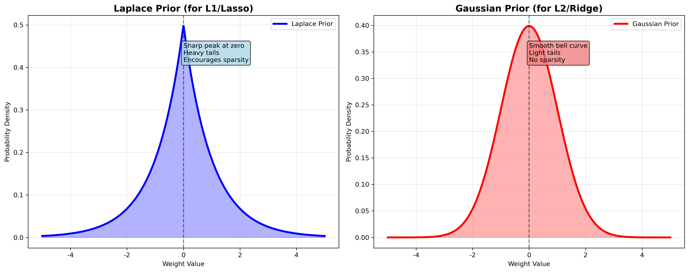

# 正则化专题 - 详细答案

## 问题: Lasso/Ridge 的解释和先验分布

### 🎯 中文理解 (便于记忆)

#### Lasso vs Ridge = "不同的学习策略"
想象两种不同的学习方法：
- **Lasso (L1)**：像"重点突破"，只学最重要的知识，其他直接忽略
  - 先验：认为大部分特征都是无用的
  - 结果：自动删除不重要特征
  
- **Ridge (L2)**：像"全面学习"，所有知识都要学，但不要钻牛角尖
  - 先验：认为所有特征都有用，但不要过度
  - 结果：保留所有特征，但权重变小

#### 先验分布 = "学习前的假设"
- **Lasso的先验**：Laplace分布，在零点有尖锐峰值
- **Ridge的先验**：Gaussian分布，平滑的钟形曲线

### 🎤 直接面试回答 (Direct Interview Answer)

**Lasso (Least Absolute Shrinkage and Selection Operator) uses L1 regularization with a Laplace prior distribution that has sharp peaks at zero, encouraging sparsity and automatic feature selection. Ridge regression uses L2 regularization with a Gaussian prior distribution that is smooth and centered at zero, encouraging small but non-zero coefficients.**

**The prior distributions are:** Lasso corresponds to P(w) ∝ exp(-λ|w|) (Laplace prior) which assumes most weights should be zero. Ridge corresponds to P(w) ∝ exp(-λw²/2) (Gaussian prior) which assumes all weights should be small but non-zero.

**From a Bayesian perspective, regularization is equivalent to maximum a posteriori (MAP) estimation** where the regularization term acts as prior knowledge about the parameter distribution. Lasso's Laplace prior encourages sparsity, while Ridge's Gaussian prior encourages shrinkage.

**I choose Lasso when I believe many features are irrelevant** and want automatic feature selection. **I choose Ridge when I believe all features are potentially useful** but want to prevent overfitting through weight shrinkage.

---

### 📝 英文标准面试答案 (English Interview Answer)

#### 1. Lasso Explanation

**Lasso (Least Absolute Shrinkage and Selection Operator):**

**Objective Function:**
```python
L(w) = (1/2n)||y - Xw||² + λ||w||₁
```

**Prior Distribution:**
```python
# Laplace (Double Exponential) Prior
P(w) ∝ exp(-λ|w|)
```

**Characteristics:**
- **Mean**: 0
- **Variance**: 2/λ²
- **Shape**: Sharp peak at zero, heavy tails
- **Effect**: Encourages sparsity, automatic feature selection

#### 2. Ridge Explanation

**Ridge Regression:**

**Objective Function:**
```python
L(w) = (1/2n)||y - Xw||² + λ||w||₂²
```

**Prior Distribution:**
```python
# Gaussian (Normal) Prior
P(w) ∝ exp(-λw²/2)
```

**Characteristics:**
- **Mean**: 0
- **Variance**: 1/λ
- **Shape**: Smooth bell curve
- **Effect**: No sparsity, shrinks all coefficients

#### 3. Bayesian Interpretation

**Maximum Likelihood Estimation (No Regularization):**
```python
w_ML = argmax P(y|X, w)
```

**Maximum A Posteriori Estimation (With Regularization):**
```python
w_MAP = argmax P(y|X, w) × P(w)
```

**The regularization term P(w) represents prior knowledge:**
- **Lasso**: "Most weights should be zero"
- **Ridge**: "All weights should be small"

#### 4. Prior Distribution Visualization

**Laplace Prior (for Lasso):**
```python
import numpy as np
import matplotlib.pyplot as plt
from scipy import stats

def plot_prior_distributions():
    """Plot Laplace and Gaussian priors"""
    w = np.linspace(-5, 5, 1000)
    
    # Laplace prior
    laplace_pdf = 0.5 * np.exp(-np.abs(w))
    
    # Gaussian prior
    gaussian_pdf = (1/np.sqrt(2*np.pi)) * np.exp(-0.5 * w**2)
    
    plt.figure(figsize=(12, 5))
    
    plt.subplot(1, 2, 1)
    plt.plot(w, laplace_pdf, 'b-', linewidth=3, label='Laplace Prior')
    plt.fill_between(w, laplace_pdf, alpha=0.3, color='blue')
    plt.title('Laplace Prior (for Lasso)')
    plt.xlabel('Weight Value')
    plt.ylabel('Probability Density')
    plt.legend()
    plt.grid(True)
    
    plt.subplot(1, 2, 2)
    plt.plot(w, gaussian_pdf, 'r-', linewidth=3, label='Gaussian Prior')
    plt.fill_between(w, gaussian_pdf, alpha=0.3, color='red')
    plt.title('Gaussian Prior (for Ridge)')
    plt.xlabel('Weight Value')
    plt.ylabel('Probability Density')
    plt.legend()
    plt.grid(True)
    
    plt.tight_layout()
    plt.show()

if __name__ == "__main__":
    plot_prior_distributions()
```

### 💻 实际代码示例

#### Lasso and Ridge Implementation
```python
import numpy as np
from sklearn.linear_model import Lasso, Ridge
from sklearn.preprocessing import StandardScaler
from scipy import stats

class BayesianRegularizedRegression:
    def __init__(self, alpha=1.0, regularization='lasso'):
        self.alpha = alpha
        self.regularization = regularization
        self.coef_ = None
        self.scaler = StandardScaler()
    
    def fit(self, X, y):
        """Fit regularized regression with Bayesian interpretation"""
        # Standardize features
        X_scaled = self.scaler.fit_transform(X)
        
        if self.regularization == 'lasso':
            self._fit_lasso(X_scaled, y)
        elif self.regularization == 'ridge':
            self._fit_ridge(X_scaled, y)
        else:
            raise ValueError("Regularization must be 'lasso' or 'ridge'")
    
    def _fit_lasso(self, X, y):
        """Lasso with Laplace prior interpretation"""
        # Using sklearn's Lasso implementation
        lasso = Lasso(alpha=self.alpha, max_iter=10000)
        lasso.fit(X, y)
        self.coef_ = lasso.coef_
        
        # Print prior information
        print(f"Lasso with Laplace Prior:")
        print(f"Prior variance: {2/(self.alpha**2):.4f}")
        print(f"Sparsity level: {np.sum(np.abs(self.coef_) < 1e-6)}/{len(self.coef_)} features")
    
    def _fit_ridge(self, X, y):
        """Ridge with Gaussian prior interpretation"""
        # Using sklearn's Ridge implementation
        ridge = Ridge(alpha=self.alpha)
        ridge.fit(X, y)
        self.coef_ = ridge.coef_
        
        # Print prior information
        print(f"Ridge with Gaussian Prior:")
        print(f"Prior variance: {1/self.alpha:.4f}")
        print(f"All {len(self.coef_)} features retained")
    
    def predict(self, X):
        """Make predictions"""
        X_scaled = self.scaler.transform(X)
        return X_scaled @ self.coef_
    
    def get_prior_samples(self, n_samples=1000):
        """Generate samples from the prior distribution"""
        if self.regularization == 'lasso':
            # Laplace distribution
            prior_samples = np.random.laplace(0, 1/self.alpha, 
                                            (n_samples, len(self.coef_)))
        elif self.regularization == 'ridge':
            # Gaussian distribution
            prior_samples = np.random.normal(0, np.sqrt(1/self.alpha), 
                                           (n_samples, len(self.coef_)))
        
        return prior_samples

# Example usage
def prior_comparison_example():
    """Compare Lasso and Ridge priors"""
    # Generate synthetic data
    np.random.seed(42)
    n, p = 100, 10
    X = np.random.randn(n, p)
    
    # Create sparse true weights
    true_weights = np.zeros(p)
    true_weights[:3] = [2, -1.5, 1]
    y = X @ true_weights + 0.1 * np.random.randn(n)
    
    # Fit models
    lasso_model = BayesianRegularizedRegression(alpha=0.1, regularization='lasso')
    ridge_model = BayesianRegularizedRegression(alpha=0.1, regularization='ridge')
    
    print("=== LASSO MODEL ===")
    lasso_model.fit(X, y)
    
    print("\n=== RIDGE MODEL ===")
    ridge_model.fit(X, y)
    
    # Compare coefficient distributions
    print("\n=== COEFFICIENT COMPARISON ===")
    print("True weights:", true_weights)
    print("Lasso coef:  ", lasso_model.coef_)
    print("Ridge coef:  ", ridge_model.coef_)

if __name__ == "__main__":
    prior_comparison_example()
```

### 🔍 面试常见问题及回答

#### Q1: "What are the prior distributions for Lasso and Ridge?"

**English Answer:**
Lasso corresponds to a Laplace (double exponential) prior: P(w) ∝ exp(-λ|w|), which has sharp peaks at zero encouraging sparsity. Ridge corresponds to a Gaussian prior: P(w) ∝ exp(-λw²/2), which is smooth and centered at zero, encouraging small but non-zero weights.

#### Q2: "How does the Bayesian interpretation help understand regularization?"

**English Answer:**
Regularization is equivalent to maximum a posteriori (MAP) estimation where the regularization term acts as prior knowledge about parameter distribution. The prior encodes our beliefs about the model parameters before seeing the data, helping prevent overfitting by incorporating domain knowledge.

#### Q3: "Why does Lasso's Laplace prior encourage sparsity?"

**English Answer:**
The Laplace prior has a sharp peak at zero and heavy tails. This means it assigns high probability to weights near zero, encouraging the optimization algorithm to set many weights to exactly zero. The sharp peak at zero makes it easier to reach exact zero during optimization.

### 💡 实战技巧

#### 1. 先验选择标准 (Prior Selection Criteria)
- **使用Laplace先验**：相信大部分特征无关
- **使用Gaussian先验**：相信所有特征都有用

#### 2. 关键词 (Key Terms)
- **Laplace Prior**: Laplace先验
- **Gaussian Prior**: Gaussian先验
- **MAP Estimation**: 最大后验估计
- **Bayesian Interpretation**: 贝叶斯解释
- **Prior Knowledge**: 先验知识

#### 3. 常见陷阱 (Common Pitfalls)
- ❌ 不理解先验分布的数学形式
- ❌ 混淆先验和似然的作用
- ❌ 忽略先验参数λ的选择
- ❌ 不理解贝叶斯解释

### 📊 可视化理解

#### 先验分布对比


#### Lasso/Ridge 系数对比


### 📊 面试准备检查清单

- [ ] 理解Lasso和Ridge的数学定义
- [ ] 掌握Laplace和Gaussian先验分布
- [ ] 理解贝叶斯解释
- [ ] 知道先验分布如何影响结果
- [ ] 理解MAP估计的概念
- [ ] 能够解释为什么Laplace先验鼓励稀疏性
- [ ] 知道如何选择先验参数
- [ ] 理解先验知识的实际意义

### 🎯 练习建议

1. **理论练习**: 理解贝叶斯统计基础
2. **数学练习**: 推导MAP估计公式
3. **可视化练习**: 绘制不同先验分布
4. **应用练习**: 在不同数据上比较效果
5. **参数练习**: 调整先验参数观察影响

**记住**: 正则化本质上是贝叶斯方法，先验分布编码了我们对参数的先验信念！
