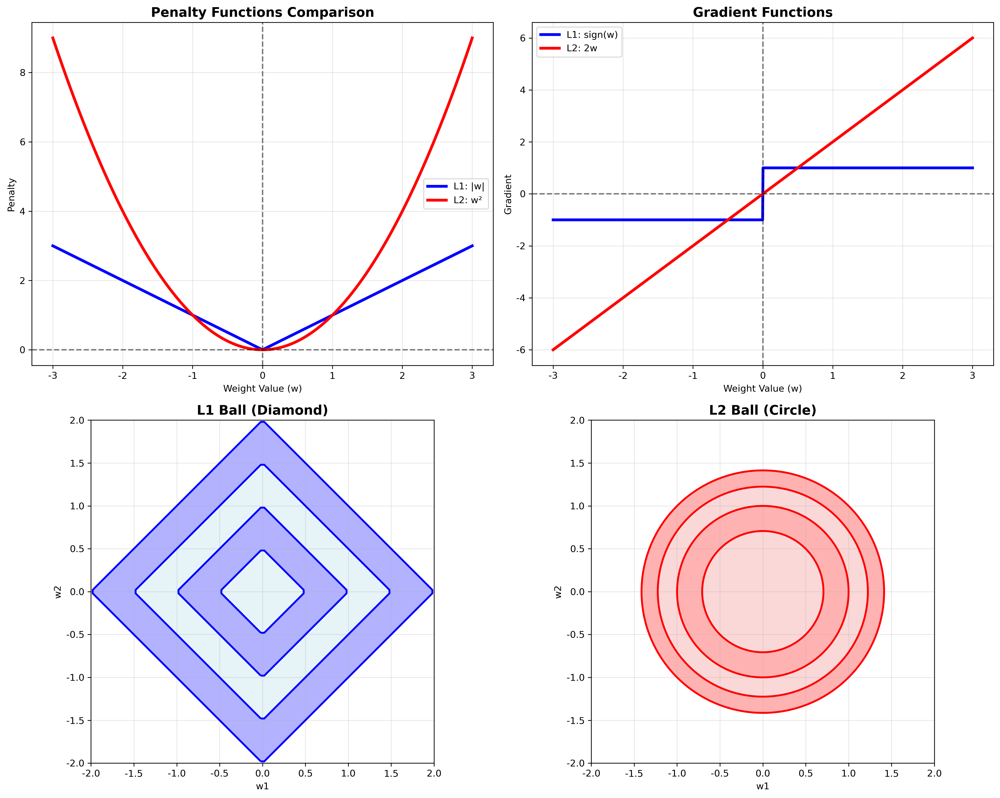
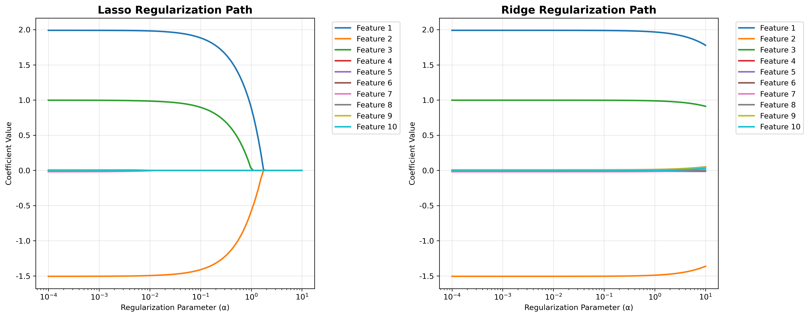

# 正则化专题 - 详细答案

## 问题: 为什么L1比L2稀疏，为什么正则化有效

### 🎯 中文理解 (便于记忆)

#### 稀疏性 = "自动删除无用特征"
想象整理房间的过程：
- **L1正则化**：像"断舍离"，直接扔掉不需要的东西
  - 机制：在零点有尖锐拐角，容易"跳"到零
  - 结果：很多权重直接变为0
  
- **L2正则化**：像"整理收纳"，所有东西都保留但放整齐
  - 机制：平滑曲线，很难到达确切的零
  - 结果：所有权重都保留，但数值变小

#### 为什么正则化有效？
- **防止过拟合**：限制模型复杂度
- **提高泛化能力**：在训练集和测试集上都表现好
- **偏差-方差权衡**：适当增加偏差，大幅减少方差

### 🎤 直接面试回答 (Direct Interview Answer)

**L1 is more sparse than L2 because L1's absolute penalty function has sharp corners at zero where the gradient is discontinuous, making it easier for optimization algorithms to push weights to exactly zero. L2's smooth squared penalty makes it difficult to reach exact zero during optimization.**

**Regularization works through the bias-variance tradeoff:** `Total Error = Bias² + Variance + Irreducible Error`. Without regularization, we have low bias but high variance (overfitting). Regularization slightly increases bias but dramatically reduces variance, improving generalization.

**Mathematically, L1's gradient sign(w) jumps from -1 to +1 at zero**, allowing the optimization to "cross" zero and reach exact zero. **L2's gradient 2w approaches zero smoothly but rarely reaches it** because the gradient becomes very small near zero.

**From a Bayesian perspective, regularization acts as prior knowledge** about parameter distributions, preventing the model from overfitting to training noise while maintaining useful patterns.

---

### 📝 英文标准面试答案 (English Interview Answer)

#### 1. Why L1 is More Sparse Than L2

**Mathematical Explanation:**

**L1 Penalty Function:**
```python
f(w) = |w|
f'(w) = sign(w) = {
    1,  if w > 0
    -1, if w < 0
    undefined at w = 0  # Subgradient
}
```

**L2 Penalty Function:**
```python
f(w) = w²
f'(w) = 2w  # Continuous everywhere
```

**Key Insight:**
- **L1 has discontinuous gradient at zero**
- **L2 has continuous gradient everywhere**
- **Optimization can "jump" to zero with L1**
- **L2 gradient approaches zero smoothly**

#### 2. Geometric Explanation

**L1 Constraint Region (Diamond):**
```python
# L1 ball: |w₁| + |w₂| ≤ t
# Forms diamond shape with sharp corners
# Intersects loss function at corners → sparse solutions
```

**L2 Constraint Region (Circle):**
```python
# L2 ball: w₁² + w₂² ≤ t
# Forms circle with smooth boundary
# Intersects loss function smoothly → no sparsity
```

#### 3. Optimization Perspective

**L1 Optimization Behavior:**
```python
# When w approaches zero:
# Gradient jumps from -λ to +λ
# Allows crossing zero and reaching exact zero
# Soft thresholding: w = S(rho, λ)
```

**L2 Optimization Behavior:**
```python
# When w approaches zero:
# Gradient approaches 2w → 0
# Never reaches exact zero
# Smooth shrinkage: w = rho / (1 + λ)
```

#### 4. Why Regularization Works

**Statistical Perspective - Bias-Variance Tradeoff:**

```python
Total Error = Bias² + Variance + Irreducible Error
```

**Without Regularization:**
- **Low bias, high variance** (overfitting)
- **Model memorizes training data**
- **Poor generalization to new data**

**With Regularization:**
- **Slightly higher bias, much lower variance**
- **Better generalization**
- **Improved performance on test data**

**Mathematical Derivation:**
```python
# For Ridge regression:
E[(ŷ - y)²] = E[(Xw - Xw*)²] + σ²
           = E[(X(w - w*))²] + σ²
           = (w - w*)ᵀE[XᵀX](w - w*) + σ²
           = Bias² + Variance + Noise
```

#### 5. Bayesian Interpretation

**Maximum Likelihood (No Regularization):**
```python
w_ML = argmax P(y|X, w)
```

**Maximum A Posteriori (With Regularization):**
```python
w_MAP = argmax P(y|X, w) × P(w)
```

**Regularization as Prior Knowledge:**
- **L1**: "Most weights should be zero"
- **L2**: "All weights should be small"

#### 6. Detailed Mathematical Analysis

**L1 Sparsity Mechanism:**
```python
def l1_sparsity_analysis():
    """Analyze why L1 creates sparsity"""
    # Consider the optimization problem:
    # min_w (1/2n)||y - Xw||² + λ||w||₁
    
    # For coordinate j, the optimality condition is:
    # -(1/n)X_j^T(y - Xw) + λ ∂|w_j|/∂w_j = 0
    
    # This gives us the soft thresholding rule:
    # w_j = S(rho_j, λ) where rho_j = (1/n)X_j^T(y - Xw_{-j})
    
    # The soft thresholding function:
    # S(a, b) = sign(a) * max(|a| - b, 0)
    
    # Key property: S(a, b) = 0 when |a| ≤ b
    # This means w_j = 0 when |rho_j| ≤ λ
    # This is the sparsity condition!
```

**L2 Shrinkage Mechanism:**
```python
def l2_shrinkage_analysis():
    """Analyze why L2 doesn't create sparsity"""
    # For Ridge regression:
    # min_w (1/2n)||y - Xw||² + λ||w||₂²
    
    # The optimality condition is:
    # -(1/n)X^T(y - Xw) + λw = 0
    
    # Solving for w:
    # w = (X^T X + nλI)^(-1) X^T y
    
    # Notice that (X^T X + nλI) is always invertible
    # and the solution is unique and non-zero (unless λ → ∞)
    
    # The shrinkage factor for each eigenvalue:
    # s_i / (s_i + nλ) where s_i are eigenvalues of X^T X
    # This shrinks but never zeros out coefficients
```

### 💻 实际代码示例

#### Sparsity Analysis Implementation
```python
import numpy as np
import matplotlib.pyplot as plt
from sklearn.linear_model import Lasso, Ridge
from sklearn.preprocessing import StandardScaler

class SparsityAnalyzer:
    def __init__(self):
        self.scaler = StandardScaler()
    
    def analyze_sparsity_patterns(self, X, y, alphas):
        """Analyze sparsity patterns for different regularization strengths"""
        X_scaled = self.scaler.fit_transform(X)
        
        l1_sparsity = []
        l2_sparsity = []
        l1_coefs = []
        l2_coefs = []
        
        for alpha in alphas:
            # L1 regularization
            lasso = Lasso(alpha=alpha, max_iter=10000)
            lasso.fit(X_scaled, y)
            l1_coef = lasso.coef_
            l1_sparsity.append(np.sum(np.abs(l1_coef) < 1e-6))
            l1_coefs.append(l1_coef.copy())
            
            # L2 regularization
            ridge = Ridge(alpha=alpha)
            ridge.fit(X_scaled, y)
            l2_coef = ridge.coef_
            l2_sparsity.append(np.sum(np.abs(l2_coef) < 1e-6))
            l2_coefs.append(l2_coef.copy())
        
        return l1_sparsity, l2_sparsity, l1_coefs, l2_coefs
    
    def plot_sparsity_comparison(self, X, y):
        """Plot sparsity comparison between L1 and L2"""
        alphas = np.logspace(-4, 2, 50)
        l1_sparsity, l2_sparsity, l1_coefs, l2_coefs = self.analyze_sparsity_patterns(X, y, alphas)
        
        fig, ((ax1, ax2), (ax3, ax4)) = plt.subplots(2, 2, figsize=(15, 12))
        
        # Sparsity vs regularization strength
        ax1.plot(alphas, l1_sparsity, 'b-', linewidth=2, label='L1 (Lasso)')
        ax1.plot(alphas, l2_sparsity, 'r-', linewidth=2, label='L2 (Ridge)')
        ax1.set_xscale('log')
        ax1.set_xlabel('Regularization Strength (α)')
        ax1.set_ylabel('Number of Zero Coefficients')
        ax1.set_title('Sparsity Comparison')
        ax1.legend()
        ax1.grid(True)
        
        # Coefficient paths
        l1_coefs_array = np.array(l1_coefs).T
        l2_coefs_array = np.array(l2_coefs).T
        
        for i in range(min(5, l1_coefs_array.shape[0])):
            ax2.plot(alphas, l1_coefs_array[i], label=f'Feature {i+1}')
        ax2.set_xscale('log')
        ax2.set_xlabel('Regularization Strength (α)')
        ax2.set_ylabel('Coefficient Value')
        ax2.set_title('L1 Regularization Paths')
        ax2.legend()
        ax2.grid(True)
        
        for i in range(min(5, l2_coefs_array.shape[0])):
            ax3.plot(alphas, l2_coefs_array[i], label=f'Feature {i+1}')
        ax3.set_xscale('log')
        ax3.set_xlabel('Regularization Strength (α)')
        ax3.set_ylabel('Coefficient Value')
        ax3.set_title('L2 Regularization Paths')
        ax3.legend()
        ax3.grid(True)
        
        # Final coefficients comparison
        final_l1 = l1_coefs[-1]
        final_l2 = l2_coefs[-1]
        
        x_pos = np.arange(len(final_l1))
        ax4.bar(x_pos - 0.2, final_l1, 0.4, label='L1', alpha=0.7)
        ax4.bar(x_pos + 0.2, final_l2, 0.4, label='L2', alpha=0.7)
        ax4.set_xlabel('Feature Index')
        ax4.set_ylabel('Final Coefficient Value')
        ax4.set_title('Final Coefficients Comparison')
        ax4.legend()
        ax4.grid(True)
        
        plt.tight_layout()
        plt.show()
        
        return l1_sparsity, l2_sparsity

def bias_variance_analysis():
    """Demonstrate bias-variance tradeoff with regularization"""
    np.random.seed(42)
    
    # Generate data
    n_train, n_test = 100, 50
    p = 20
    
    X_train = np.random.randn(n_train, p)
    X_test = np.random.randn(n_test, p)
    
    # True sparse coefficients
    true_w = np.zeros(p)
    true_w[:5] = [2, -1.5, 1, -0.5, 0.8]
    
    y_train = X_train @ true_w + 0.1 * np.random.randn(n_train)
    y_test = X_test @ true_w + 0.1 * np.random.randn(n_test)
    
    # Standardize
    scaler = StandardScaler()
    X_train_scaled = scaler.fit_transform(X_train)
    X_test_scaled = scaler.transform(X_test)
    
    # Test different regularization strengths
    alphas = np.logspace(-4, 2, 20)
    train_errors = []
    test_errors = []
    bias_squared = []
    variance_est = []
    
    for alpha in alphas:
        # L1 regularization
        lasso = Lasso(alpha=alpha, max_iter=10000)
        lasso.fit(X_train_scaled, y_train)
        
        # Predictions
        y_train_pred = lasso.predict(X_train_scaled)
        y_test_pred = lasso.predict(X_test_scaled)
        
        # Calculate errors
        train_error = np.mean((y_train - y_train_pred)**2)
        test_error = np.mean((y_test - y_test_pred)**2)
        
        # Estimate bias and variance
        bias_sq = np.mean((y_test - y_test_pred)**2) - np.var(y_test - y_test_pred)
        variance = np.var(y_test_pred)
        
        train_errors.append(train_error)
        test_errors.append(test_error)
        bias_squared.append(max(0, bias_sq))
        variance_est.append(variance)
    
    # Plot bias-variance tradeoff
    plt.figure(figsize=(12, 4))
    
    plt.subplot(1, 3, 1)
    plt.plot(alphas, train_errors, 'b-', label='Training Error')
    plt.plot(alphas, test_errors, 'r-', label='Test Error')
    plt.xscale('log')
    plt.xlabel('Regularization Strength (α)')
    plt.ylabel('Mean Squared Error')
    plt.title('Bias-Variance Tradeoff')
    plt.legend()
    plt.grid(True)
    
    plt.subplot(1, 3, 2)
    plt.plot(alphas, bias_squared, 'g-', label='Bias²')
    plt.plot(alphas, variance_est, 'orange', label='Variance')
    plt.xscale('log')
    plt.xlabel('Regularization Strength (α)')
    plt.ylabel('Error Component')
    plt.title('Bias² vs Variance')
    plt.legend()
    plt.grid(True)
    
    plt.subplot(1, 3, 3)
    total_error = np.array(bias_squared) + np.array(variance_est)
    plt.plot(alphas, total_error, 'purple', label='Total Error')
    plt.plot(alphas, test_errors, 'r--', label='Actual Test Error')
    plt.xscale('log')
    plt.xlabel('Regularization Strength (α)')
    plt.ylabel('Error')
    plt.title('Total Error Decomposition')
    plt.legend()
    plt.grid(True)
    
    plt.tight_layout()
    plt.show()

# Example usage
def sparsity_demonstration():
    """Demonstrate sparsity differences"""
    # Generate synthetic data
    np.random.seed(42)
    n, p = 100, 20
    X = np.random.randn(n, p)
    
    # Create sparse true weights
    true_weights = np.zeros(p)
    true_weights[:5] = [2, -1.5, 1, -0.5, 0.8]
    y = X @ true_weights + 0.1 * np.random.randn(n)
    
    # Analyze sparsity
    analyzer = SparsityAnalyzer()
    analyzer.plot_sparsity_comparison(X, y)
    
    # Bias-variance analysis
    bias_variance_analysis()

if __name__ == "__main__":
    sparsity_demonstration()
```

### 🔍 面试常见问题及回答

#### Q1: "Why does L1 regularization create sparse solutions while L2 doesn't?"

**English Answer:**
L1's absolute penalty function has sharp corners at zero where the gradient is discontinuous. During optimization, when a weight approaches zero, the L1 penalty can "push" it to exactly zero through the soft thresholding mechanism. L2's smooth squared penalty makes it difficult to reach exactly zero because the gradient approaches zero smoothly but never allows crossing to exact zero.

#### Q2: "How does regularization prevent overfitting?"

**English Answer:**
Regularization works through the bias-variance tradeoff. Without regularization, models have low bias but high variance (overfitting). Regularization slightly increases bias but dramatically reduces variance by constraining model complexity. This improves generalization performance on unseen data by preventing the model from memorizing training noise.

#### Q3: "What's the mathematical intuition behind L1 sparsity?"

**English Answer:**
The mathematical intuition comes from the soft thresholding rule: w_j = S(rho_j, λ) = sign(rho_j)max(|rho_j|-λ,0). When |rho_j| ≤ λ, the coefficient becomes exactly zero. This thresholding behavior is a direct consequence of L1's non-differentiable penalty at zero, creating the sparsity property.

### 💡 实战技巧

#### 1. 稀疏性理解 (Sparsity Understanding)
- **L1**: 软阈值机制导致稀疏性
- **L2**: 平滑收缩，无稀疏性
- **几何**: L1球有尖锐拐角，L2球平滑

#### 2. 关键词 (Key Terms)
- **Sparsity**: 稀疏性
- **Soft Thresholding**: 软阈值
- **Bias-Variance Tradeoff**: 偏差-方差权衡
- **Discontinuous Gradient**: 不连续梯度
- **Generalization**: 泛化能力

#### 3. 常见陷阱 (Common Pitfalls)
- ❌ 不理解为什么L1产生稀疏解
- ❌ 混淆偏差和方差的作用
- ❌ 忽略正则化参数的调优
- ❌ 不理解贝叶斯解释

### 📊 可视化理解

#### 稀疏性可视化


#### L1 vs L2 正则化对比


#### 正则化路径


### 📊 面试准备检查清单

- [ ] 理解L1稀疏性的数学机制
- [ ] 掌握软阈值函数的作用
- [ ] 理解偏差-方差权衡
- [ ] 知道正则化为什么有效
- [ ] 理解几何解释
- [ ] 掌握贝叶斯解释
- [ ] 能够分析正则化参数的影响
- [ ] 理解泛化能力的提升机制

### 🎯 练习建议

1. **理论练习**: 理解稀疏性的数学原理
2. **可视化练习**: 绘制L1和L2的优化路径
3. **实验练习**: 在不同数据上观察稀疏性
4. **分析练习**: 分析偏差-方差权衡
5. **参数练习**: 调优正则化参数

**记住**: L1的稀疏性来自软阈值机制，正则化的有效性来自偏差-方差权衡！
